# 1. MoH Helpdesk Administrator Guide

Welcome to the MoH Helpdesk! You’ve just deployed our centralized support system. Instead of jumping in blindly, use this quick guide to learn the basics so you can immediately start creating, assigning, tracking, and resolving tickets efficiently. 

---

## 1.1 Logging In

- **Admin:** Organization admin/Admin log in to the main platform workspace to manage teams, routing, and system configurations.

  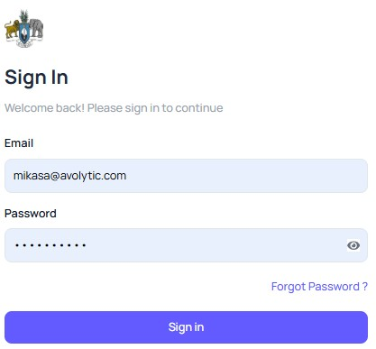

---

## 1.2 Creating Users & Managing Access

The first thing to do in the platform is to set up your users. Organization administrators can log in and subsequently create users to assign to various system roles across available modules.  

  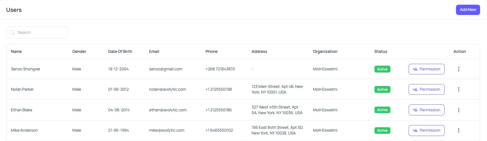

System access is divided into three major service areas with role designations:  
* **Service Desk Roles:** Service Desk Admin, Service Desk Agent, and Service Desk Expert.  
* **Facility Management Roles:** Facility Management Admin.  
* **Admin Panel Roles:** System Admin.  

### 1.2.1 Administrator Directory Capabilities
Users with system administration permissions have the necessary privileges to manage accounts from the core directory. As a System Admin, you can:  
* Create new users.  
* Change user passwords.  
* Edit existing user profile information.  
* Deactivate or activate user accounts when required.  

### 1.2.2 Setting Role Permissions
Administrators with system administration privileges can also access the Permissions dashboard to modify feature-wise permissions for each role. This ensures you can control precise access to features on a granular level rather than assigning broad capabilities across the platform.  

  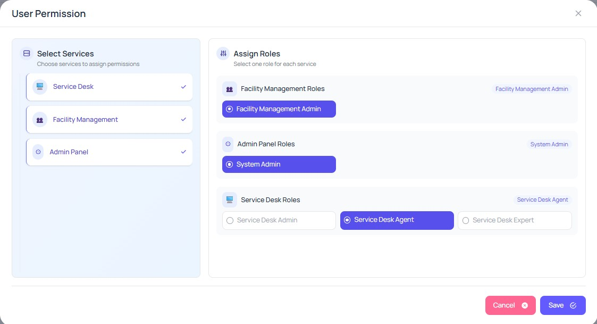

  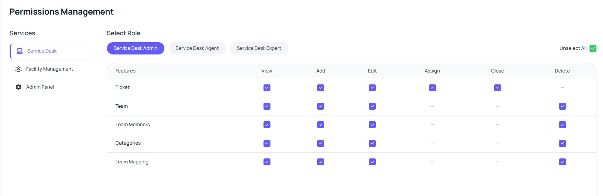

---

## 1.3 User Requests

The User Requests page is used to review and track password recovery related user requests. It helps administrators monitor incoming requests and complete account recovery actions seamlessly.  

### 1.3.1 Request Queue
The request queue shows all submitted user requests with detailed requester information and the exact submission date. Administrators can review each request in the queue.  

  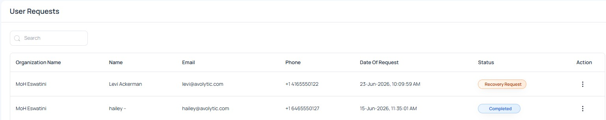
---

## 1.4 Organizations & Portal Settings

The Organizations page allows administrators to view and update organization details, contact information, and public portal settings. This page is used to manage organization profile information and control public portal access.  

  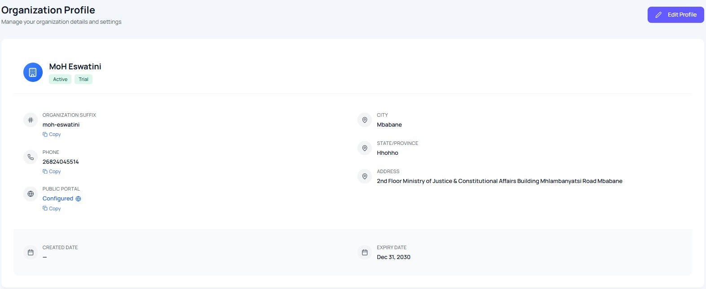

### 1.4.1 Public Portal Control
Administrators can enable or disable the organization’s public support portal.  
* **When Enabled:** Facility users can access the live public portal URL and submit support tickets using their existing account.  
* **When Disabled:** Public portal access is blocked, restricting ticket submissions to internal channels.  

---

## 1.5 Configuring Email Integration

The Email Settings page is used to configure mail accounts and email templates for platform services. This page ensures that each service can send and receive system emails using the correct SMTP/IMAP settings and notification templates.  

### 1.5.1 Email Configuration
The email configuration section displays all added mail accounts with their current status and unique configuration options. Administrators can review active or inactive mail accounts and update settings when required.  

  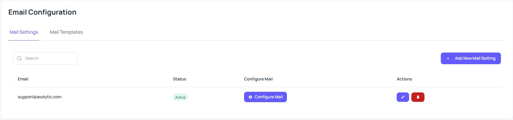

### 1.5.2 Configure Mail Mappings
The Configure Mail option allows administrators to link a specific mail account with explicit system services, such as:  
* CRM  
* Call Center  
* Service Desk  
* Device Manager  
* Client Management  
* Admin Panel  

  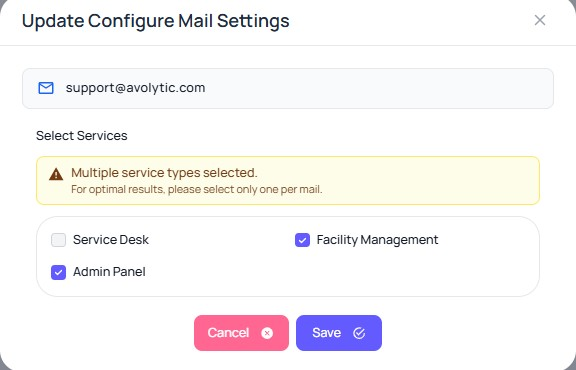

### 1.5.3 Managing Mail Templates
The mail templates section is used to manage automated email templates for different services and notification types. Administrators can create and update template names, subjects, and email body content using rich text editing.  

  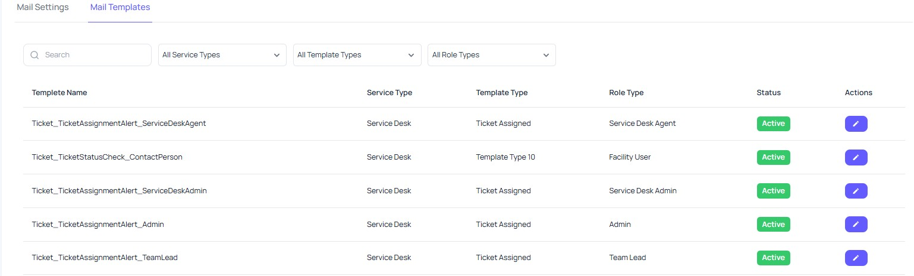

### 1.5.4 Dynamic Variables & Live Previews
Email templates can include Dynamic Variables that automatically fill with real data during email delivery. Example variables include `${customerName}`, `${dealName}`, and `${organizationName}`.  

To verify your configurations before saving, use the Live Preview panel to see exactly how the email will appear to recipients when sent.  

  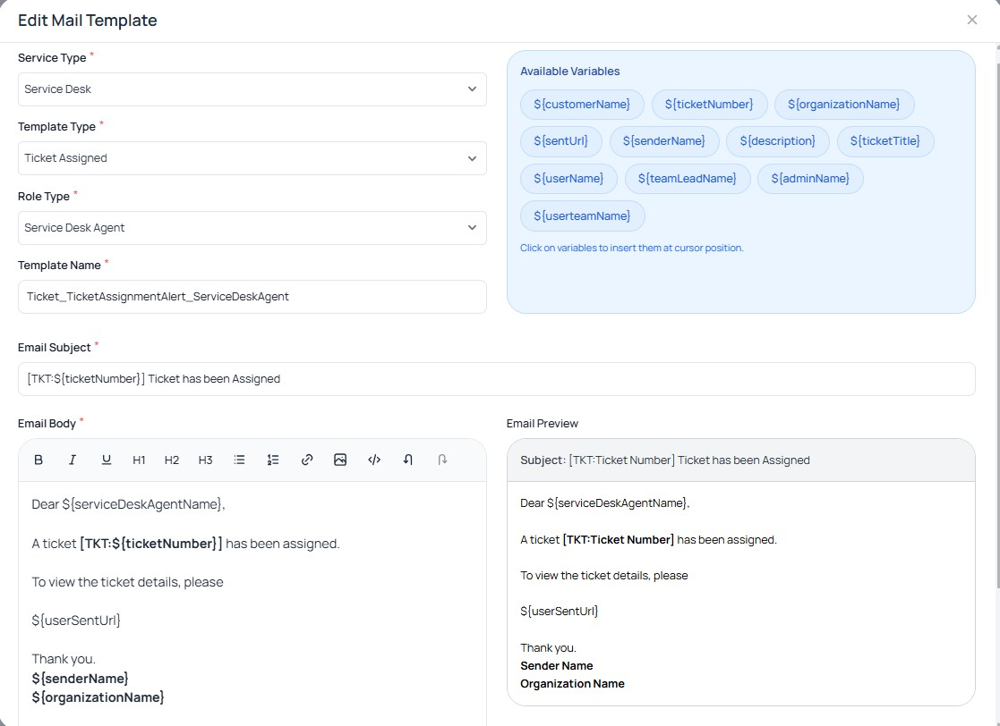

---

## 1.6 Setting Up Automation

The Automation page allows administrators to configure automated notification rules for each platform service.  

### 1.6.1 Event Configuration
Administrators can choose which system events trigger alerts and who receives those alerts. For each selected service, you can configure the specific notification recipients and communication channels. Supported channels include Email.  

  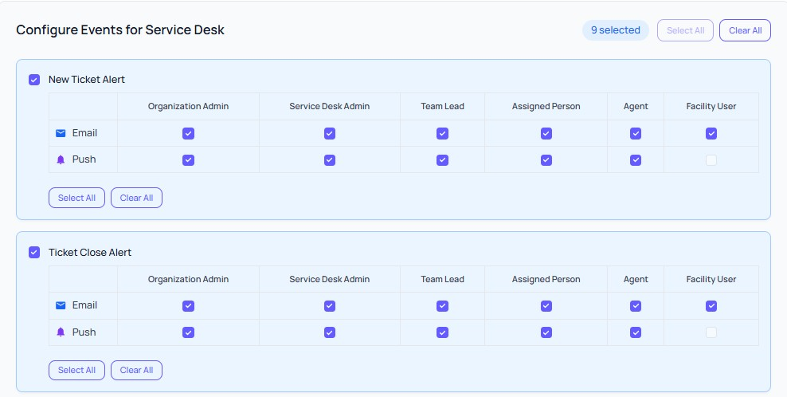

---

## 1.7 Facility Management Access

Besides utilizing the standard Admin Panel, administrators may also operate Facility Management features based on their assigned system permissions.  

### 1.7.1 Managing Health Facilities
Administrators can create, edit, delete, and manage health facility records. This ensures the platform maintains an accurate, up-to-date picture of all health facility data across the system.  

  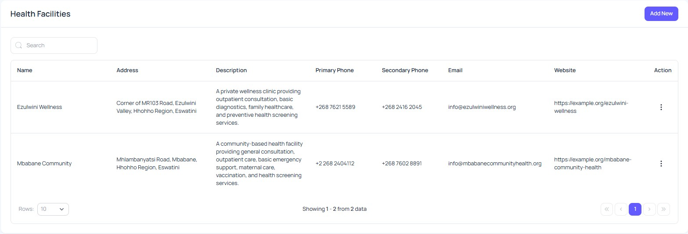

### 1.7.2 Managing Facility Users
Administrators can fully create and manage facility user accounts so that end users can log in to the public portal to log tickets. Within this space, administrators can:  
* Create facility user accounts.  
* Set initial facility user passwords.  
* Change facility user passwords for recovery.  
* Edit facility user profile information.  
* Delete facility users from the platform.  

  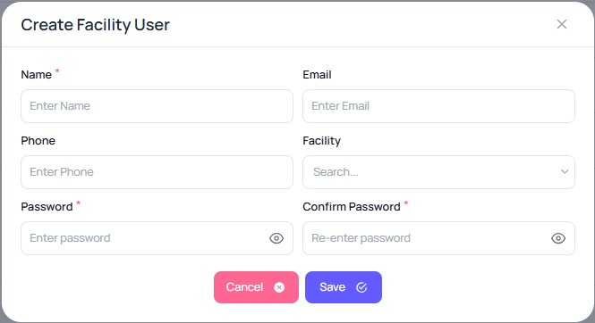

---

## 1.8 What's Next?

### 1.8.1 Explore the Admin Panel
The best way to continue learning your new system is to explore. Click on all the menu items, open all the tabs and look everywhere. 

### 1.8.2 Encourage Users to Begin Logging Tickets
In order to get the most out of your platform, you need to use it! Make sure your facility users begin using the public portal for submitting requests, and ensure that your Service Desk Admins, Agents, and Experts start logging in to manage their assigned queues.  

Enjoy your new platform!