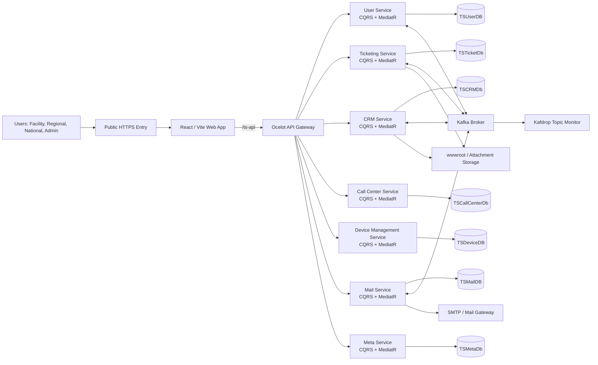
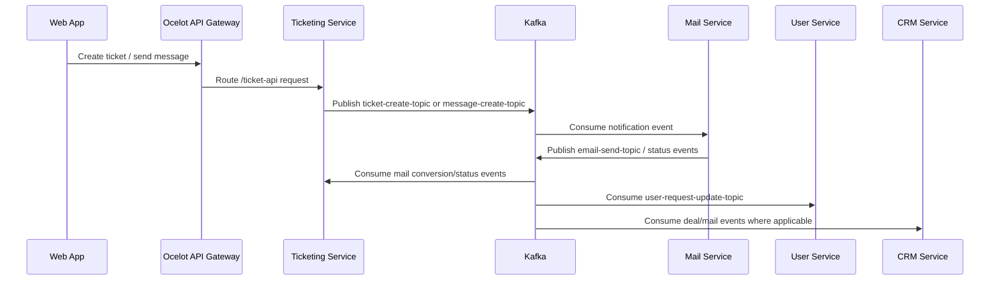
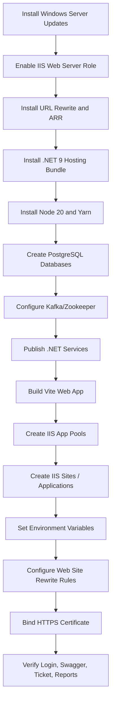
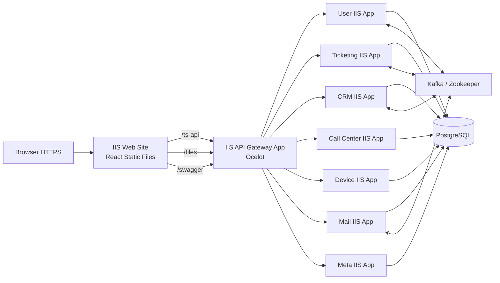
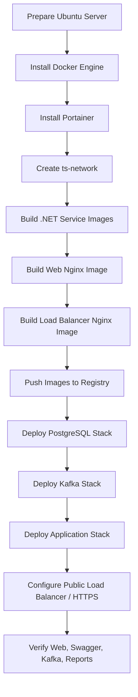
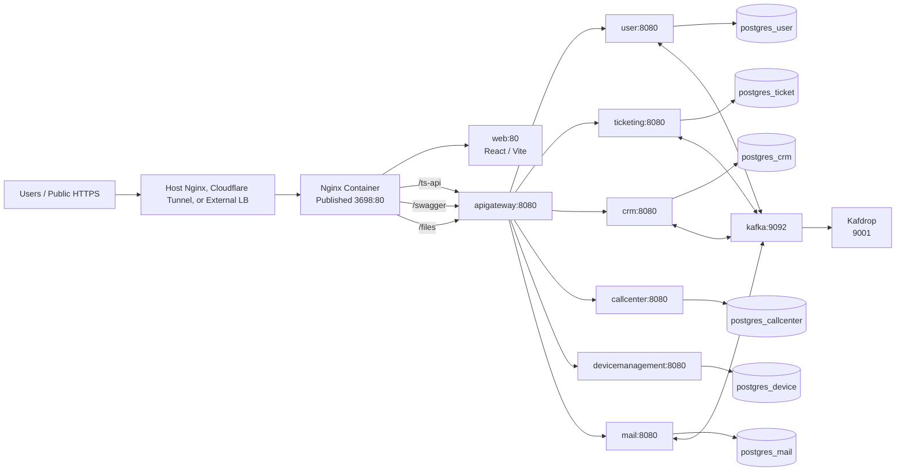
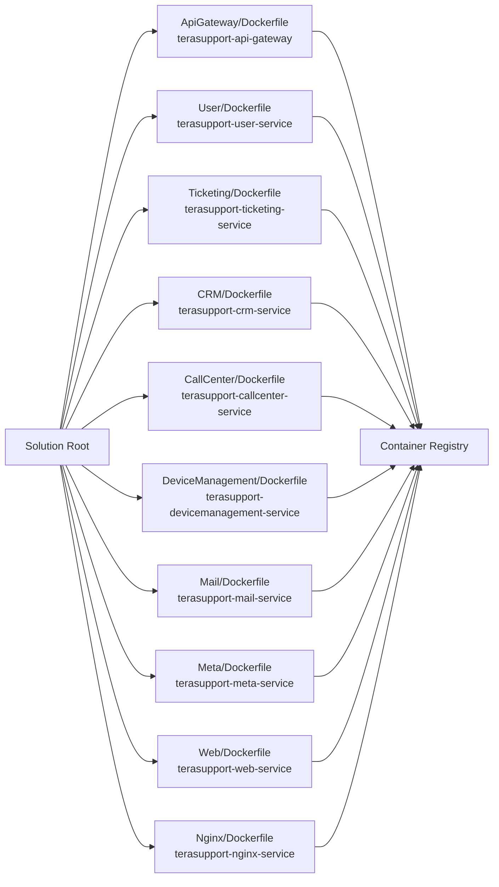

import ZoomableImage from '@site/src/components/ZoomableImage';
import deploymentTopology from './images/deployment_topology.png';

# 1. Installation Manual

This installation manual is based on the actual TeraSupport solution located at:

```text
/Users/etl/Desktop/TeraSupport/TeraSupport_Avolytic/TeraSupport
```

The platform is a .NET 9 CQRS/MediatR microservice system with an Ocelot API Gateway, PostgreSQL databases, Kafka event messaging, and a Vite React web application. This guide covers:

- Windows Server deployment with IIS.
- IIS reverse proxy and application pool configuration.
- Kafka and Zookeeper configuration.
- .NET service configuration.
- Required software packages.
- Linux deployment with Docker, Nginx load balancer, and Portainer.
- Docker image build, push, and stack deployment.
- Screenshot checklist for visual handover documentation.

---

## 1.0 Visual Deployment Overview

Use this diagram as the first visual in the installation manual. It shows how users enter the system and how the .NET 9 CQRS/MediatR services, Ocelot API Gateway, PostgreSQL, Kafka, and web frontend fit together.



### 1.0.1 Visual Handover Storyboard

Capture screenshots in this order so the final document reads like a real deployment story.

| Step | Visual Type | What to Show | Screenshot File |
| ---: | --- | --- | --- |
| 1 | Diagram | Overall application topology | Mermaid diagram above |
| 2 | Screenshot | Windows Server roles with IIS selected | `windows-server-iis-role.png` |
| 3 | Screenshot | IIS URL Rewrite and ARR installed | `windows-url-rewrite-arr.png` |
| 4 | Screenshot | .NET 9 Hosting Bundle/runtime installed | `windows-dotnet-runtime-list.png` |
| 5 | Screenshot | PostgreSQL databases created | `windows-postgres-databases.png` |
| 6 | Screenshot | Kafka/Zookeeper running and topic list | `windows-kafka-topic-list.png` |
| 7 | Screenshot | IIS app pools for all services | `iis-app-pools.png` |
| 8 | Screenshot | IIS bindings and HTTPS certificate | `iis-site-bindings.png` |
| 9 | Screenshot | API Gateway environment variables | `iis-apigateway-env-vars.png` |
| 10 | Screenshot | Gateway Swagger page | `gateway-swagger.png` |
| 11 | Screenshot | Linux Docker network and images | `linux-docker-images.png` |
| 12 | Screenshot | Portainer DB stack | `portainer-db-stack.png` |
| 13 | Screenshot | Portainer Kafka stack and Kafdrop | `portainer-kafka-stack.png` |
| 14 | Screenshot | Portainer application stack | `portainer-app-stack.png` |
| 15 | Screenshot | Nginx/load balancer route | `linux-nginx-route-config.png` |
| 16 | Screenshot | Web login page over HTTPS | `linux-public-login.png` |
| 17 | Screenshot | Ticket creation and report export | `ticket-created.png`, `report-export.png` |

### 1.0.2 Windows Visual Walkthrough

Use these visual slots as the screenshot plan for the Windows Server/IIS deployment. Each slot should be replaced with a real screenshot after installation.

<div className="visual-step-grid">
  <div className="visual-step">
    <div className="visual-step-header"><span className="visual-step-code">STEP WIN-01</span><span className="visual-step-title">Enable IIS Role</span></div>
    <div className="visual-step-frame"><div className="visual-step-frame-inner">Screenshot: Server Manager - Add Roles and Features - Web Server (IIS)</div></div>
    <div className="visual-step-body"><p>Show IIS selected with required role services before clicking Install.</p><ul><li>File: <code>windows-server-iis-role.png</code></li><li>Verify: IIS Manager opens after installation.</li></ul></div>
  </div>
  <div className="visual-step">
    <div className="visual-step-header"><span className="visual-step-code">STEP WIN-02</span><span className="visual-step-title">Install Rewrite and ARR</span></div>
    <div className="visual-step-frame"><div className="visual-step-frame-inner">Screenshot: IIS Manager showing URL Rewrite and ARR proxy settings</div></div>
    <div className="visual-step-body"><p>Show URL Rewrite installed and ARR proxy enabled for API Gateway forwarding.</p><ul><li>File: <code>windows-url-rewrite-arr.png</code></li><li>Verify: Server Proxy Settings has proxy enabled.</li></ul></div>
  </div>
  <div className="visual-step">
    <div className="visual-step-header"><span className="visual-step-code">STEP WIN-03</span><span className="visual-step-title">Install .NET 9 Runtime</span></div>
    <div className="visual-step-frame"><div className="visual-step-frame-inner">Screenshot: PowerShell output for dotnet --list-runtimes</div></div>
    <div className="visual-step-body"><p>Show .NET 9 ASP.NET Core runtime and Hosting Bundle available on the server.</p><ul><li>File: <code>windows-dotnet-runtime-list.png</code></li><li>Verify: IIS was restarted after installation.</li></ul></div>
  </div>
  <div className="visual-step">
    <div className="visual-step-header"><span className="visual-step-code">STEP WIN-04</span><span className="visual-step-title">Prepare Databases</span></div>
    <div className="visual-step-frame"><div className="visual-step-frame-inner">Screenshot: pgAdmin or psql database list</div></div>
    <div className="visual-step-body"><p>Show service databases for User, Ticketing, CRM, Call Center, Device, and Mail.</p><ul><li>File: <code>windows-postgres-databases.png</code></li><li>Verify: service database user has access.</li></ul></div>
  </div>
  <div className="visual-step">
    <div className="visual-step-header"><span className="visual-step-code">STEP WIN-05</span><span className="visual-step-title">Configure Kafka</span></div>
    <div className="visual-step-frame"><div className="visual-step-frame-inner">Screenshot: Kafka topic list or Kafdrop equivalent</div></div>
    <div className="visual-step-body"><p>Show Zookeeper, Kafka broker, and required TeraSupport topics.</p><ul><li>File: <code>windows-kafka-topic-list.png</code></li><li>Verify: services use <code>KAFKA_HOST</code> and <code>KAFKA_PORT</code>.</li></ul></div>
  </div>
  <div className="visual-step">
    <div className="visual-step-header"><span className="visual-step-code">STEP WIN-06</span><span className="visual-step-title">Publish Services</span></div>
    <div className="visual-step-frame"><div className="visual-step-frame-inner">Screenshot: Visual Studio Publish screen or PowerShell publish output</div></div>
    <div className="visual-step-body"><p>Show Release publish output for ApiGateway, User, Ticketing, CRM, CallCenter, DeviceManagement, Mail, and Meta.</p><ul><li>File: <code>windows-dotnet-publish-output.png</code></li><li>Verify: each folder contains the service DLL and web.config.</li></ul></div>
  </div>
  <div className="visual-step">
    <div className="visual-step-header"><span className="visual-step-code">STEP WIN-07</span><span className="visual-step-title">Build Web App</span></div>
    <div className="visual-step-frame"><div className="visual-step-frame-inner">Screenshot: yarn build success and Web/dist folder</div></div>
    <div className="visual-step-body"><p>Show the Vite web build using production <code>VITE_API_URL</code>.</p><ul><li>File: <code>windows-web-build-dist.png</code></li><li>Verify: <code>dist</code> copied to IIS web folder.</li></ul></div>
  </div>
  <div className="visual-step">
    <div className="visual-step-header"><span className="visual-step-code">STEP WIN-08</span><span className="visual-step-title">Create App Pools</span></div>
    <div className="visual-step-frame"><div className="visual-step-frame-inner">Screenshot: IIS Application Pools list</div></div>
    <div className="visual-step-body"><p>Show one app pool per service with No Managed Code, AlwaysRunning, and idle timeout disabled.</p><ul><li>File: <code>iis-app-pools.png</code></li><li>Verify: app pools are started.</li></ul></div>
  </div>
  <div className="visual-step">
    <div className="visual-step-header"><span className="visual-step-code">STEP WIN-09</span><span className="visual-step-title">Bind Sites and Ports</span></div>
    <div className="visual-step-frame"><div className="visual-step-frame-inner">Screenshot: IIS Bindings window</div></div>
    <div className="visual-step-body"><p>Show HTTPS binding for public web and private bindings for service applications.</p><ul><li>File: <code>iis-site-bindings.png</code></li><li>Verify: certificate is selected.</li></ul></div>
  </div>
  <div className="visual-step">
    <div className="visual-step-header"><span className="visual-step-code">STEP WIN-10</span><span className="visual-step-title">Set Environment Variables</span></div>
    <div className="visual-step-frame"><div className="visual-step-frame-inner">Screenshot: IIS Configuration Editor environment variables</div></div>
    <div className="visual-step-body"><p>Show API Gateway and service variables such as Ocelot downstream hosts, DB connection, JWT, and Kafka.</p><ul><li>File: <code>iis-apigateway-env-vars.png</code></li><li>Verify: app pool recycled after changes.</li></ul></div>
  </div>
  <div className="visual-step">
    <div className="visual-step-header"><span className="visual-step-code">STEP WIN-11</span><span className="visual-step-title">Configure Rewrite Rules</span></div>
    <div className="visual-step-frame"><div className="visual-step-frame-inner">Screenshot: IIS URL Rewrite rules for /ts-api, /files, /swagger</div></div>
    <div className="visual-step-body"><p>Show reverse proxy rules from the web site to the API Gateway.</p><ul><li>File: <code>iis-url-rewrite-rules.png</code></li><li>Verify: React SPA fallback is below API rules.</li></ul></div>
  </div>
  <div className="visual-step">
    <div className="visual-step-header"><span className="visual-step-code">STEP WIN-12</span><span className="visual-step-title">Verify Application</span></div>
    <div className="visual-step-frame"><div className="visual-step-frame-inner">Screenshot: login page, gateway Swagger, ticket created, report exported</div></div>
    <div className="visual-step-body"><p>Show final proof that UI, API, Kafka, reports, and notifications work.</p><ul><li>Files: <code>iis-web-login.png</code>, <code>gateway-swagger.png</code>, <code>ticket-created.png</code></li><li>Verify: no startup errors in logs.</li></ul></div>
  </div>
</div>

### 1.0.3 Linux / Portainer Visual Walkthrough

Use these visual slots as the screenshot plan for the Linux Docker and Portainer deployment.

<div className="visual-step-grid">
  <div className="visual-step">
    <div className="visual-step-header"><span className="visual-step-code">STEP LNX-01</span><span className="visual-step-title">Prepare Server</span></div>
    <div className="visual-step-frame"><div className="visual-step-frame-inner">Screenshot: Ubuntu version, Docker version, Docker Compose version</div></div>
    <div className="visual-step-body"><p>Show the Linux host is updated and Docker is installed.</p><ul><li>File: <code>linux-docker-version.png</code></li><li>Verify: Docker service is enabled and running.</li></ul></div>
  </div>
  <div className="visual-step">
    <div className="visual-step-header"><span className="visual-step-code">STEP LNX-02</span><span className="visual-step-title">Create Docker Network</span></div>
    <div className="visual-step-frame"><div className="visual-step-frame-inner">Screenshot: docker network ls showing ts-network</div></div>
    <div className="visual-step-body"><p>Show the external <code>ts-network</code> required by compose files.</p><ul><li>File: <code>linux-docker-network.png</code></li><li>Verify: all stacks attach to the same network.</li></ul></div>
  </div>
  <div className="visual-step">
    <div className="visual-step-header"><span className="visual-step-code">STEP LNX-03</span><span className="visual-step-title">Install Portainer</span></div>
    <div className="visual-step-frame"><div className="visual-step-frame-inner">Screenshot: Portainer local environment dashboard</div></div>
    <div className="visual-step-body"><p>Show Portainer is running on the server and connected to the local Docker engine.</p><ul><li>File: <code>portainer-local-environment.png</code></li><li>Verify: admin account is created.</li></ul></div>
  </div>
  <div className="visual-step">
    <div className="visual-step-header"><span className="visual-step-code">STEP LNX-04</span><span className="visual-step-title">Build Images</span></div>
    <div className="visual-step-frame"><div className="visual-step-frame-inner">Screenshot: Docker images for all TeraSupport services</div></div>
    <div className="visual-step-body"><p>Show images for API Gateway, User, Ticketing, CRM, CallCenter, Device, Mail, Meta, Web, and Nginx.</p><ul><li>File: <code>linux-docker-images.png</code></li><li>Verify: tags match production compose image names.</li></ul></div>
  </div>
  <div className="visual-step">
    <div className="visual-step-header"><span className="visual-step-code">STEP LNX-05</span><span className="visual-step-title">Deploy PostgreSQL Stack</span></div>
    <div className="visual-step-frame"><div className="visual-step-frame-inner">Screenshot: Portainer stack details for prod.postgres.compose.yml</div></div>
    <div className="visual-step-body"><p>Show all PostgreSQL containers healthy with persistent volumes.</p><ul><li>File: <code>portainer-db-stack.png</code></li><li>Verify: User, Ticket, CRM, CallCenter, Device, Mail DBs exist.</li></ul></div>
  </div>
  <div className="visual-step">
    <div className="visual-step-header"><span className="visual-step-code">STEP LNX-06</span><span className="visual-step-title">Deploy Kafka Stack</span></div>
    <div className="visual-step-frame"><div className="visual-step-frame-inner">Screenshot: Portainer Kafka stack and Kafdrop topic list</div></div>
    <div className="visual-step-body"><p>Show Zookeeper, Kafka, and Kafdrop containers running.</p><ul><li>Files: <code>portainer-kafka-stack.png</code>, <code>kafdrop-topic-list.png</code></li><li>Verify: broker address is <code>kafka:9092</code> for app containers.</li></ul></div>
  </div>
  <div className="visual-step">
    <div className="visual-step-header"><span className="visual-step-code">STEP LNX-07</span><span className="visual-step-title">Deploy App Stack</span></div>
    <div className="visual-step-frame"><div className="visual-step-frame-inner">Screenshot: Portainer app stack with all containers running</div></div>
    <div className="visual-step-body"><p>Show ApiGateway, Web, Nginx, User, Ticketing, CRM, CallCenter, DeviceManagement, Mail, and optional Meta.</p><ul><li>File: <code>portainer-app-stack.png</code></li><li>Verify: no restart loops.</li></ul></div>
  </div>
  <div className="visual-step">
    <div className="visual-step-header"><span className="visual-step-code">STEP LNX-08</span><span className="visual-step-title">Set Stack Variables</span></div>
    <div className="visual-step-frame"><div className="visual-step-frame-inner">Screenshot: Portainer stack environment values with secrets masked</div></div>
    <div className="visual-step-body"><p>Show Ocelot variables, DB hosts, Kafka host/port, JWT key, and service URLs.</p><ul><li>File: <code>portainer-env-vars.png</code></li><li>Verify: secrets are masked before documentation sharing.</li></ul></div>
  </div>
  <div className="visual-step">
    <div className="visual-step-header"><span className="visual-step-code">STEP LNX-09</span><span className="visual-step-title">Configure Load Balancer</span></div>
    <div className="visual-step-frame"><div className="visual-step-frame-inner">Screenshot: Nginx route config for /, /ts-api, /files, /swagger</div></div>
    <div className="visual-step-body"><p>Show the load balancer forwarding public traffic to the Nginx container and API Gateway.</p><ul><li>File: <code>linux-nginx-route-config.png</code></li><li>Verify: upload size and proxy headers are configured.</li></ul></div>
  </div>
  <div className="visual-step">
    <div className="visual-step-header"><span className="visual-step-code">STEP LNX-10</span><span className="visual-step-title">Verify Public HTTPS</span></div>
    <div className="visual-step-frame"><div className="visual-step-frame-inner">Screenshot: HTTPS login page and browser certificate status</div></div>
    <div className="visual-step-body"><p>Show the final public URL loading over HTTPS.</p><ul><li>Files: <code>linux-public-login.png</code>, <code>linux-ssl-certificate.png</code></li><li>Verify: HTTP redirects to HTTPS.</li></ul></div>
  </div>
  <div className="visual-step">
    <div className="visual-step-header"><span className="visual-step-code">STEP LNX-11</span><span className="visual-step-title">Verify APIs and Reports</span></div>
    <div className="visual-step-frame"><div className="visual-step-frame-inner">Screenshot: Gateway Swagger, ticket workflow, report export</div></div>
    <div className="visual-step-body"><p>Show end-to-end function after deployment.</p><ul><li>Files: <code>gateway-swagger.png</code>, <code>ticket-created.png</code>, <code>report-export.png</code></li><li>Verify: Kafka and Mail logs show events.</li></ul></div>
  </div>
</div>

---

## 1.1 Application Components

| Component | Project | Runtime | Purpose |
| --- | --- | --- | --- |
| API Gateway | `ApiGateway/ApiGateway.csproj` | .NET 9 | Ocelot reverse gateway for all backend APIs. |
| User Service | `User/User.csproj` | .NET 9 | Authentication, users, roles, organizations, contacts, regions. |
| Ticketing Service | `Ticketing/Ticketing.csproj` | .NET 9 | Tickets, categories, assignment, messages, reports, attachments. |
| CRM Service | `CRM/CRM.csproj` | .NET 9 | CRM and deal/mail workflows. |
| Call Center Service | `CallCenter/CallCenter.csproj` | .NET 9 | Call center module. |
| Device Management Service | `DeviceManagement/DeviceManagement.csproj` | .NET 9 | Devices, RDP/device integrations, device tracking. |
| Mail Service | `Mail/Mail.csproj` | .NET 9 | Mail ingestion, SMTP dispatch, Kafka mail workflows. |
| Meta Service | `Meta/Meta.csproj` | .NET 9 | Social/meta integration features. |
| Web App | `Web/` | Node 20, Vite, React 19 | User interface served by IIS or Nginx. |
| Nginx | `Nginx/default.conf` | Nginx | Linux container load balancer/reverse proxy. |

Supporting projects:

| Project | Purpose |
| --- | --- |
| `Utilities` | Shared helper classes, Kafka topics/groups, response utilities. |
| `Shared.Authorization` | Shared authorization/JWT support for services. |
| `Authorization.Shared` | Shared authorization package. |

---

## 1.2 Required Packages and Tools

### 1.2.1 Windows Server Packages

Install these on the Windows Server:

| Package | Required Version / Notes |
| --- | --- |
| Windows Server | 2019 or later recommended. |
| IIS | Web Server role with Management Console. |
| .NET Hosting Bundle | .NET 9 Hosting Bundle for IIS hosting. |
| .NET SDK | .NET 9 SDK if building on the server. |
| ASP.NET Core Runtime | Included with Hosting Bundle. |
| URL Rewrite | IIS URL Rewrite module. |
| Application Request Routing | IIS ARR module for reverse proxy. |
| Node.js | Node 20 LTS for building the web app. |
| Yarn | Required by the `Web/Dockerfile` and web project lockfile. |
| PostgreSQL | PostgreSQL 17 recommended, or a managed PostgreSQL server. |
| Kafka | Apache Kafka or Confluent Platform 7.4 compatible broker. |
| Git | Required if pulling source code directly on the server. |
| NSSM or Windows Service wrapper | Optional, only if running services outside IIS. |

### 1.2.2 Linux Packages

Install these on the Linux host:

| Package | Required Version / Notes |
| --- | --- |
| Ubuntu Server | 22.04 LTS or 24.04 LTS recommended. |
| Docker Engine | Current stable release. |
| Docker Compose plugin | Required for local compose validation/build. |
| Portainer CE | Used for stack deployment and visual operations. |
| Git | Required for pulling source code. |
| Nginx / Traefik / Cloudflare Tunnel | Public load-balancing or reverse-proxy option. |
| PostgreSQL container | Existing compose uses `postgres:17.5`. |
| Kafka/Zookeeper containers | Existing compose uses Confluent Platform `7.4.0`. |
| Node 20 | Optional on host if building web outside Docker. |
| .NET 9 SDK | Optional on host if building services outside Docker. |

---

## 1.3 Database Layout

The solution uses PostgreSQL and separates databases by service domain.

| Service | Database | Default Docker Host |
| --- | --- | --- |
| User | `TSUserDB` | `terasupport-db_postgres_user` |
| Call Center | `TSCallCenterDb` | `terasupport-db_postgres_callcenter` |
| CRM | `TSCRMDb` | `terasupport-db_postgres_crm` |
| Device Management | `TSDeviceDB` | `terasupport-db_postgres_device` |
| Mail | `TSMailDB` | `terasupport-db_postgres_mail` |
| Ticketing | `TSTicketDb` | `terasupport-db_postgres_ticket` |

The repository includes:

```text
Docker/db-compose.yml
Docker/init-scripts/create-dbs.sh
prod.postgres.compose.yml
```

For production, use a strong database password and rotate any existing sample credentials before deployment.

---

## 1.4 Environment Variables

The services use .NET configuration binding, so nested settings are supplied with double underscores.

### 1.4.1 Common Variables

| Variable | Example | Used By |
| --- | --- | --- |
| `ASPNETCORE_ENVIRONMENT` | `Production` | All .NET services |
| `ALLOWEDHOSTS` | `*` or production host | All .NET services |
| `LOGGING__LOGLEVEL__DEFAULT` | `Information` | All .NET services |
| `LOGGING__LOGLEVEL__MICROSOFT_ASPNETCORE` | `Warning` | All .NET services |
| `CONNECTIONSTRINGS__DBLOCATION` | `Host=db;Port=5432;Database=TSUserDB;Username=...;Password=...` | Services with EF Core |
| `JWT__KEY` | Production secret | API Gateway, Ticketing |
| `KAFKA_HOST` | `kafka` or server hostname | User, Ticketing, CRM, Mail |
| `KAFKA_PORT` | `9092` inside Docker, `29092` host access | User, Ticketing, CRM, Mail |

### 1.4.2 API Gateway Variables

| Variable | Example |
| --- | --- |
| `OCELOTVARIABLES__DOWNSTREAMSCHEME` | `http` for Docker, `https` for IIS local HTTPS |
| `OCELOTVARIABLES__USERMANAGEMENTSERVICEHOST` | `user` or `localhost` |
| `OCELOTVARIABLES__USERMANAGEMENTSERVICEPORT` | `8080` or `7250` |
| `OCELOTVARIABLES__TICKETINGSYSTEMSERVICEHOST` | `ticketing` or `localhost` |
| `OCELOTVARIABLES__TICKETINGSYSTEMSERVICEPORT` | `8080` or `7137` |
| `OCELOTVARIABLES__CRMSERVICEHOST` | `crm` or `localhost` |
| `OCELOTVARIABLES__CRMSERVICEPORT` | `8080` or `7126` |
| `OCELOTVARIABLES__CALLCENTERHOST` | `callcenter` or `localhost` |
| `OCELOTVARIABLES__CALLCENTERPORT` | `8080` or `5042` |
| `OCELOTVARIABLES__DEVICEHOST` | `devicemanagement` or `localhost` |
| `OCELOTVARIABLES__DEVICEPORT` | `8080` or `7094` |
| `OCELOTVARIABLES__MAILSERVICEHOST` | `mail` or `localhost` |
| `OCELOTVARIABLES__MAILSERVICEPORT` | `8080` or `7122` |
| `OCELOTVARIABLES__METASERVICEHOST` | `meta` or `localhost` |
| `OCELOTVARIABLES__METASERVICEPORT` | `8080` or `5121` |

### 1.4.3 Service-Specific Variables

| Service | Variables |
| --- | --- |
| User | `MAILAPI__BASEURL`, `KAFKA_HOST`, `KAFKA_PORT`, `CONNECTIONSTRINGS__DBLOCATION` |
| Ticketing | `FILESETTING__FILEBASEURL`, `USERSERVICE__BASEURL`, `APISETTINGS__BASEURL`, `CRMSETTINGS__BASEURL`, `JWT__KEY`, `KAFKA_HOST`, `KAFKA_PORT`, `AISETTINGS__...` |
| CRM | `BASEAPISETTINGS__USERSERVICE`, `FILESETTING__FILEBASEURL`, `KAFKA_HOST`, `KAFKA_PORT` |
| Device Management | `REMOTEDEVICESETTINGS__BASEURL`, `REMOTEDEVICESETTINGS__AUTHTOKEN`, `APISETTINGS__BASEURL`, `APISETTINGS__TICKETAPIURL` |
| Mail | `DB_HOST`, `DB_PORT`, `DB_NAME`, `DB_USER`, `DB_PASSWORD`, `KAFKA_HOST`, `KAFKA_PORT`, `TicketHTTP_HOST` |
| Meta | `FACEBOOK__...`, `INSTAGRAMS__...`, `SERVERBASE__URL`, `BASEAPISETTINGS__USERSERVICE`, `FILESETTING__FILEBASEURL` |
| Web | `VITE_API_URL`, `VITE_OLLAMA_BASE_URL`, `VITE_OLLAMA_PROXY_TARGET`, `VITE_OLLAMA_DEFAULT_MODEL` |

Do not copy development `.env` secrets directly into production. Replace all tokens, passwords, JWT keys, remote-device tokens, and social API credentials.

---

## 1.5 Development and Production Ports

### 1.5.1 Development Ports From `launchSettings.json`

| Service | HTTP | HTTPS |
| --- | ---: | ---: |
| API Gateway | 5256 | 7062 |
| User | 5184 | 7250 |
| Ticketing | 5193 | 7137 |
| CRM | 5265 | 7126 |
| Call Center | 5042 | 7012 |
| Device Management | 5028 | 7094 |
| Mail | 5070 | 7122 |
| Meta | 5121 | 7247 |

### 1.5.2 Docker Runtime Ports

Each .NET Dockerfile exposes internal port `8080`. Nginx publishes the external web/load-balancer port.

| Container | Internal Port | Public Exposure |
| --- | ---: | --- |
| `apigateway` | 8080 | Internal, through Nginx |
| `user` | 8080 | Internal |
| `ticketing` | 8080 | Internal |
| `crm` | 8080 | Internal |
| `callcenter` | 8080 | Internal |
| `devicemanagement` | 8080 | Internal |
| `mail` | 8080 | Internal |
| `meta` | 8080 | Internal |
| `web` | 80 | Internal, through Nginx |
| `nginx` | 80 | Public mapped port, current compose uses `3698:80` |
| `kafka` | 9092 / 29092 | Internal Docker / external host access |
| `kafdrop` | 9000 | Current compose maps host `9001` |

---

## 1.6 Kafka Configuration

The repository includes a Kafka stack:

```text
prod.kafka.compose.yml
```

It defines:

| Container | Image | Purpose |
| --- | --- | --- |
| `zookeeper` | `confluentinc/cp-zookeeper:7.4.0` | Kafka coordination. |
| `kafka` | `confluentinc/cp-kafka:7.4.0` | Event broker. |
| `kafdrop` | `obsidiandynamics/kafdrop` | Web UI for topic inspection. |

Kafka listeners:

| Listener | Address | Use |
| --- | --- | --- |
| Internal Docker | `kafka:9092` | Used by containers. |
| Host access | `localhost:29092` | Used by local Visual Studio or host services. |

### 1.6.1 Kafka Event Flow Diagram



### 1.6.2 Kafka Topics

Topic constants are defined in `Utilities/kafka/KafkaTopics.cs`.

| Topic |
| --- |
| `mail-config-topic` |
| `ticket-create-topic` |
| `mail-fetch-topic` |
| `mail-ticket-topic` |
| `mail-message-topic` |
| `email-send-topic` |
| `message-create-topic` |
| `custom-email-send-topic` |
| `deal-mail-topic` |
| `update-deal-mail-topic` |
| `get-ticket-status-topic` |
| `create-user-request-topic` |
| `user-request-update-topic` |
| `deal-ticket-topic` |
| `mail-deal-topic` |
| `deal-mail-notification-topic` |

### 1.6.3 Kafka Consumer Groups

Consumer groups are defined in `Utilities/kafka/KafkaGroups.cs`.

| Group |
| --- |
| `mail-sent-group` |
| `mail-config-group` |
| `mail-fetch-group` |
| `ticket-message-group` |
| `ticket-conversion-group` |
| `email-send-group` |
| `message-create-group` |
| `custom-email-send-group` |
| `deal-mail-group` |
| `update-deal-mail-group` |
| `get-ticket-status-group` |
| `create-user-request-group` |
| `update-user-request-group` |
| `create-mail-deal-group` |
| `deal-mail-notification-group` |

### 1.6.4 Kafka Screenshot Checklist

Capture these screenshots for the visual installation manual:

| Screenshot | File Name |
| --- | --- |
| Kafka and Zookeeper containers running | `kafka-containers-running.png` |
| Kafdrop broker overview | `kafdrop-broker-overview.png` |
| Topic list in Kafdrop | `kafdrop-topic-list.png` |
| Consumer groups in Kafdrop | `kafdrop-consumer-groups.png` |
| Service logs showing Kafka subscription | `service-kafka-subscription-log.png` |

Store screenshots under:

```text
docs/images/installation/
```

---

## 1.7 Windows Server Deployment With IIS

### 1.7.0 Windows / IIS Deployment Flow

This diagram shows the Windows deployment sequence and the main IIS routing relationship.





### 1.7.1 Windows Server Preparation

1. Sign in to the Windows Server using an administrator account.
2. Install all Windows updates.
3. Open **Server Manager**.
4. Select **Add roles and features**.
5. Enable **Web Server (IIS)**.
6. Enable IIS role services:
   - Web Server
   - Common HTTP Features
   - Static Content
   - Default Document
   - HTTP Errors
   - Health and Diagnostics
   - HTTP Logging
   - Security
   - Request Filtering
   - Application Development
   - ASP.NET Core Hosting support through Hosting Bundle
   - Management Tools
   - IIS Management Console
7. Install **URL Rewrite**.
8. Install **Application Request Routing**.
9. Open IIS Manager and enable proxy:
   - Select server node.
   - Open **Application Request Routing Cache**.
   - Click **Server Proxy Settings**.
   - Enable **Enable proxy**.
   - Apply changes.

Screenshot required:

| Screen | File Name |
| --- | --- |
| Server Manager IIS role selection | `windows-server-iis-role.png` |
| IIS role services selection | `windows-iis-role-services.png` |
| URL Rewrite installed | `windows-url-rewrite-installed.png` |
| ARR proxy enabled | `windows-arr-proxy-enabled.png` |

### 1.7.2 Install .NET 9 Hosting Bundle

1. Download the .NET 9 Hosting Bundle from Microsoft.
2. Run the installer as Administrator.
3. Restart IIS:

```powershell
iisreset
```

4. Confirm runtime installation:

```powershell
dotnet --list-runtimes
dotnet --list-sdks
```

Screenshot required:

| Screen | File Name |
| --- | --- |
| .NET Hosting Bundle installer completed | `windows-dotnet-hosting-bundle.png` |
| `dotnet --list-runtimes` output | `windows-dotnet-runtime-list.png` |

### 1.7.3 Install Node and Yarn for Web Build

Install Node.js 20 LTS, then install Yarn:

```powershell
npm install --global yarn
node --version
yarn --version
```

Build the web application:

```powershell
cd C:\Source\TeraSupport\Web
yarn install --frozen-lockfile
yarn build
```

The production web files are generated in:

```text
Web\dist
```

### 1.7.4 Prepare PostgreSQL on Windows

Option A: Use a dedicated PostgreSQL server.

Option B: Install PostgreSQL directly on the Windows Server.

Create the required databases:

```sql
CREATE DATABASE "TSUserDB";
CREATE DATABASE "TSCallCenterDb";
CREATE DATABASE "TSCRMDb";
CREATE DATABASE "TSDeviceDB";
CREATE DATABASE "TSMailDB";
CREATE DATABASE "TSTicketDb";
```

Create a production database user:

```sql
CREATE USER terasupport_prod WITH PASSWORD '<strong-password>';
GRANT ALL PRIVILEGES ON DATABASE "TSUserDB" TO terasupport_prod;
GRANT ALL PRIVILEGES ON DATABASE "TSCallCenterDb" TO terasupport_prod;
GRANT ALL PRIVILEGES ON DATABASE "TSCRMDb" TO terasupport_prod;
GRANT ALL PRIVILEGES ON DATABASE "TSDeviceDB" TO terasupport_prod;
GRANT ALL PRIVILEGES ON DATABASE "TSMailDB" TO terasupport_prod;
GRANT ALL PRIVILEGES ON DATABASE "TSTicketDb" TO terasupport_prod;
```

Screenshot required:

| Screen | File Name |
| --- | --- |
| PostgreSQL service running | `windows-postgres-service.png` |
| Database list | `windows-postgres-databases.png` |
| Database user/role | `windows-postgres-user-role.png` |

### 1.7.5 Prepare Kafka on Windows

Recommended production option: run Kafka on a Linux/Docker infrastructure and allow Windows-hosted .NET services to connect through `KAFKA_HOST` and `KAFKA_PORT`.

If Kafka must run on Windows:

1. Install Java Runtime required by the Kafka distribution.
2. Download Apache Kafka or Confluent Platform.
3. Extract Kafka to:

```text
C:\kafka
```

4. Configure Zookeeper and Kafka listeners.
5. Start Zookeeper:

```powershell
cd C:\kafka
.\bin\windows\zookeeper-server-start.bat .\config\zookeeper.properties
```

6. Start Kafka:

```powershell
cd C:\kafka
.\bin\windows\kafka-server-start.bat .\config\server.properties
```

7. Create topics manually if auto-create is disabled:

```powershell
.\bin\windows\kafka-topics.bat --bootstrap-server localhost:9092 --create --topic ticket-create-topic
.\bin\windows\kafka-topics.bat --bootstrap-server localhost:9092 --create --topic mail-ticket-topic
.\bin\windows\kafka-topics.bat --bootstrap-server localhost:9092 --create --topic mail-message-topic
.\bin\windows\kafka-topics.bat --bootstrap-server localhost:9092 --create --topic email-send-topic
.\bin\windows\kafka-topics.bat --bootstrap-server localhost:9092 --create --topic message-create-topic
.\bin\windows\kafka-topics.bat --bootstrap-server localhost:9092 --create --topic create-user-request-topic
.\bin\windows\kafka-topics.bat --bootstrap-server localhost:9092 --create --topic user-request-update-topic
```

8. List topics:

```powershell
.\bin\windows\kafka-topics.bat --bootstrap-server localhost:9092 --list
```

Set service variables:

```text
KAFKA_HOST=localhost
KAFKA_PORT=9092
```

Screenshot required:

| Screen | File Name |
| --- | --- |
| Zookeeper running | `windows-zookeeper-running.png` |
| Kafka running | `windows-kafka-running.png` |
| Kafka topic list | `windows-kafka-topic-list.png` |

### 1.7.6 Publish .NET Services

From the solution root:

```powershell
cd C:\Source\TeraSupport
dotnet restore TS.sln
dotnet build TS.sln -c Release
```

Publish each service:

```powershell
dotnet publish ApiGateway\ApiGateway.csproj -c Release -o C:\inetpub\terasupport\apigateway
dotnet publish User\User.csproj -c Release -o C:\inetpub\terasupport\user
dotnet publish Ticketing\Ticketing.csproj -c Release -o C:\inetpub\terasupport\ticketing
dotnet publish CRM\CRM.csproj -c Release -o C:\inetpub\terasupport\crm
dotnet publish CallCenter\CallCenter.csproj -c Release -o C:\inetpub\terasupport\callcenter
dotnet publish DeviceManagement\DeviceManagement.csproj -c Release -o C:\inetpub\terasupport\devicemanagement
dotnet publish Mail\Mail.csproj -c Release -o C:\inetpub\terasupport\mail
dotnet publish Meta\Meta.csproj -c Release -o C:\inetpub\terasupport\meta
```

Copy web build output:

```powershell
New-Item -ItemType Directory -Force C:\inetpub\terasupport\web
Copy-Item C:\Source\TeraSupport\Web\dist\* C:\inetpub\terasupport\web -Recurse -Force
```

### 1.7.7 IIS Application Pools

Create one app pool per .NET service and one for the web app.

| App Pool | .NET CLR Version | Pipeline | Identity |
| --- | --- | --- | --- |
| `TeraSupport.ApiGateway` | No Managed Code | Integrated | ApplicationPoolIdentity |
| `TeraSupport.User` | No Managed Code | Integrated | ApplicationPoolIdentity |
| `TeraSupport.Ticketing` | No Managed Code | Integrated | ApplicationPoolIdentity |
| `TeraSupport.CRM` | No Managed Code | Integrated | ApplicationPoolIdentity |
| `TeraSupport.CallCenter` | No Managed Code | Integrated | ApplicationPoolIdentity |
| `TeraSupport.DeviceManagement` | No Managed Code | Integrated | ApplicationPoolIdentity |
| `TeraSupport.Mail` | No Managed Code | Integrated | ApplicationPoolIdentity |
| `TeraSupport.Meta` | No Managed Code | Integrated | ApplicationPoolIdentity |
| `TeraSupport.Web` | No Managed Code | Integrated | ApplicationPoolIdentity |

Recommended app pool settings:

| Setting | Value |
| --- | --- |
| Start Mode | AlwaysRunning |
| Idle Time-out | 0 |
| Rapid-Fail Protection | Enabled |
| Recycling | Schedule during maintenance window |
| Load User Profile | True |

Screenshot required:

| Screen | File Name |
| --- | --- |
| Application pool list | `iis-app-pools.png` |
| App pool advanced settings | `iis-app-pool-advanced-settings.png` |

### 1.7.8 IIS Site and Binding Plan

Recommended Windows deployment pattern:

| IIS Site | Binding | Physical Path |
| --- | --- | --- |
| `TeraSupport.Web` | `https://support.example.org` | `C:\inetpub\terasupport\web` |
| `TeraSupport.ApiGateway` | `http://localhost:5256` or private port | `C:\inetpub\terasupport\apigateway` |
| `TeraSupport.User` | `http://localhost:5184` or private port | `C:\inetpub\terasupport\user` |
| `TeraSupport.Ticketing` | `http://localhost:5193` or private port | `C:\inetpub\terasupport\ticketing` |
| `TeraSupport.CRM` | `http://localhost:5265` or private port | `C:\inetpub\terasupport\crm` |
| `TeraSupport.CallCenter` | `http://localhost:5042` or private port | `C:\inetpub\terasupport\callcenter` |
| `TeraSupport.DeviceManagement` | `http://localhost:5028` or private port | `C:\inetpub\terasupport\devicemanagement` |
| `TeraSupport.Mail` | `http://localhost:5070` or private port | `C:\inetpub\terasupport\mail` |
| `TeraSupport.Meta` | `http://localhost:5121` or private port | `C:\inetpub\terasupport\meta` |

Public traffic should enter through the web site and `/ts-api` should proxy to the API Gateway.

### 1.7.9 IIS Environment Variables

For each IIS application:

1. Open IIS Manager.
2. Select the application.
3. Open **Configuration Editor**.
4. Select `system.webServer/aspNetCore`.
5. Add environment variables under `environmentVariables`.
6. Apply changes.
7. Recycle the app pool.

Example for Ticketing:

```xml
<environmentVariables>
  <environmentVariable name="ASPNETCORE_ENVIRONMENT" value="Production" />
  <environmentVariable name="CONNECTIONSTRINGS__DBLOCATION" value="Host=<db-host>;Port=5432;Database=TSTicketDb;Username=<user>;Password=<password>" />
  <environmentVariable name="FILESETTING__FILEBASEURL" value="https://support.example.org/files/" />
  <environmentVariable name="USERSERVICE__BASEURL" value="https://support.example.org/ts-api/" />
  <environmentVariable name="APISETTINGS__BASEURL" value="https://support.example.org/ts-api/" />
  <environmentVariable name="KAFKA_HOST" value="<kafka-host>" />
  <environmentVariable name="KAFKA_PORT" value="9092" />
  <environmentVariable name="JWT__KEY" value="<production-jwt-secret>" />
</environmentVariables>
```

Screenshot required:

| Screen | File Name |
| --- | --- |
| IIS environment variables for API Gateway | `iis-apigateway-env-vars.png` |
| IIS environment variables for Ticketing | `iis-ticketing-env-vars.png` |
| IIS environment variables for User | `iis-user-env-vars.png` |

### 1.7.10 IIS URL Rewrite Rules

Add a `web.config` to the web site root:

```xml
<?xml version="1.0" encoding="utf-8"?>
<configuration>
  <system.webServer>
    <rewrite>
      <rules>
        <rule name="Proxy API Gateway" stopProcessing="true">
          <match url="^ts-api/(.*)" />
          <action type="Rewrite" url="http://localhost:5256/ts-api/{R:1}" />
        </rule>
        <rule name="Proxy Files" stopProcessing="true">
          <match url="^files/(.*)" />
          <action type="Rewrite" url="http://localhost:5256/files/{R:1}" />
        </rule>
        <rule name="Proxy Swagger" stopProcessing="true">
          <match url="^swagger/(.*)" />
          <action type="Rewrite" url="http://localhost:5256/swagger/{R:1}" />
        </rule>
        <rule name="React SPA Fallback" stopProcessing="true">
          <match url=".*" />
          <conditions logicalGrouping="MatchAll">
            <add input="{REQUEST_FILENAME}" matchType="IsFile" negate="true" />
            <add input="{REQUEST_FILENAME}" matchType="IsDirectory" negate="true" />
          </conditions>
          <action type="Rewrite" url="/index.html" />
        </rule>
      </rules>
    </rewrite>
  </system.webServer>
</configuration>
```

If API Gateway listens on HTTPS instead of HTTP, update the rewrite target accordingly.

### 1.7.11 Windows Verification

Verify in this order:

1. PostgreSQL is running.
2. Kafka and Zookeeper are running.
3. User service starts.
4. Ticketing service starts.
5. Mail service starts and subscribes to Kafka.
6. CRM service starts and subscribes to Kafka.
7. API Gateway starts and loads Ocelot routes.
8. Web app opens from IIS.
9. `/ts-api/swagger` or gateway Swagger opens.
10. Login works.
11. Ticket creation works.
12. Ticket assignment triggers Kafka/mail logs.
13. Attachment upload/download works.
14. Reports open and export.

Screenshot required:

| Screen | File Name |
| --- | --- |
| IIS site bindings | `iis-site-bindings.png` |
| Web app login page | `iis-web-login.png` |
| Gateway Swagger | `iis-gateway-swagger.png` |
| Successful ticket creation | `iis-ticket-created.png` |
| Windows Event Viewer service log | `iis-event-viewer-service-log.png` |

---

## 1.8 Linux Deployment With Docker and Portainer

### 1.8.0 Linux / Docker / Portainer Deployment Flow





### 1.8.0.1 Docker Image Build Map



### 1.8.1 Linux Server Preparation

1. Install Ubuntu Server.
2. Update packages:

```bash
sudo apt update
sudo apt upgrade -y
```

3. Install Docker:

```bash
sudo apt install -y ca-certificates curl gnupg
sudo install -m 0755 -d /etc/apt/keyrings
curl -fsSL https://download.docker.com/linux/ubuntu/gpg | sudo gpg --dearmor -o /etc/apt/keyrings/docker.gpg
sudo chmod a+r /etc/apt/keyrings/docker.gpg
echo "deb [arch=$(dpkg --print-architecture) signed-by=/etc/apt/keyrings/docker.gpg] https://download.docker.com/linux/ubuntu $(. /etc/os-release && echo "$VERSION_CODENAME") stable" | sudo tee /etc/apt/sources.list.d/docker.list > /dev/null
sudo apt update
sudo apt install -y docker-ce docker-ce-cli containerd.io docker-buildx-plugin docker-compose-plugin
```

4. Enable Docker:

```bash
sudo systemctl enable docker
sudo systemctl start docker
docker --version
docker compose version
```

5. Create the Docker network used by the compose files:

```bash
docker network create ts-network
```

Screenshot required:

| Screen | File Name |
| --- | --- |
| Docker version output | `linux-docker-version.png` |
| Docker network list | `linux-docker-network.png` |

### 1.8.2 Install Portainer

```bash
docker volume create portainer_data
docker run -d \
  -p 9443:9443 \
  -p 9000:9000 \
  --name portainer \
  --restart=always \
  -v /var/run/docker.sock:/var/run/docker.sock \
  -v portainer_data:/data \
  portainer/portainer-ce:latest
```

Open:

```text
https://<server-ip>:9443
```

Create the initial Portainer admin account and connect to the local Docker environment.

Screenshot required:

| Screen | File Name |
| --- | --- |
| Portainer first login | `portainer-first-login.png` |
| Portainer local environment | `portainer-local-environment.png` |

### 1.8.3 Build Docker Images

From the solution root:

```bash
cd /opt/TeraSupport
docker build -t arcapps/terasupport-api-gateway:latest -f ApiGateway/Dockerfile .
docker build -t arcapps/terasupport-user-service:latest -f User/Dockerfile .
docker build -t arcapps/terasupport-ticketing-service:latest -f Ticketing/Dockerfile .
docker build -t arcapps/terasupport-crm-service:latest -f CRM/Dockerfile .
docker build -t arcapps/terasupport-callcenter-service:latest -f CallCenter/Dockerfile .
docker build -t arcapps/terasupport-devicemanagement-service:latest -f DeviceManagement/Dockerfile .
docker build -t arcapps/terasupport-mail-service:latest -f Mail/Dockerfile .
docker build -t arcapps/terasupport-meta-service:latest -f Meta/Dockerfile .
docker build -t arcapps/terasupport-web-service:latest -f Web/Dockerfile --build-arg VITE_API_URL=/ts-api .
docker build -t arcapps/terasupport-nginx-service:latest -f Nginx/Dockerfile .
```

If using a private registry:

```bash
docker login <registry-host>
docker tag arcapps/terasupport-api-gateway:latest <registry-host>/terasupport-api-gateway:latest
docker push <registry-host>/terasupport-api-gateway:latest
```

Repeat tagging and pushing for all images.

Screenshot required:

| Screen | File Name |
| --- | --- |
| Docker image list | `linux-docker-images.png` |
| Successful image build output | `linux-image-build-output.png` |
| Registry repository list | `registry-image-list.png` |

### 1.8.4 Deploy PostgreSQL Stack in Portainer

Use:

```text
prod.postgres.compose.yml
```

Steps:

1. Open Portainer.
2. Go to **Stacks**.
3. Click **Add stack**.
4. Name it `terasupport-db`.
5. Paste the content of `prod.postgres.compose.yml`.
6. Replace all sample passwords with production secrets.
7. Deploy the stack.
8. Confirm all PostgreSQL containers are healthy.

Current compose creates separate PostgreSQL containers:

| Container | Host Port | Database |
| --- | ---: | --- |
| `postgres_user` | 5432 | `TSUserDB` |
| `postgres_callcenter` | 5433 | `TSCallCenterDb` |
| `postgres_crm` | 5434 | `TSCRMDb` |
| `postgres_device` | 5435 | `TSDeviceDB` |
| `postgres_mail` | 5436 | `TSMailDB` |
| `postgres_ticket` | 5437 | `TSTicketDb` |

Screenshot required:

| Screen | File Name |
| --- | --- |
| Portainer database stack | `portainer-db-stack.png` |
| PostgreSQL containers healthy | `portainer-postgres-healthy.png` |
| PostgreSQL volumes | `portainer-postgres-volumes.png` |

### 1.8.5 Deploy Kafka Stack in Portainer

Use:

```text
prod.kafka.compose.yml
```

Steps:

1. Open **Stacks** in Portainer.
2. Click **Add stack**.
3. Name it `terasupport-kafka`.
4. Paste the Kafka compose content.
5. Confirm `ts-network` already exists.
6. Deploy the stack.
7. Open Kafdrop on:

```text
http://<server-ip>:9001
```

8. Confirm Kafka broker is visible.
9. Confirm topics are created after services publish events.

For Docker services, set:

```text
KAFKA_HOST=kafka
KAFKA_PORT=9092
```

For host-based tools connecting from the Linux server, use:

```text
KAFKA_HOST=localhost
KAFKA_PORT=29092
```

### 1.8.6 Deploy Application Stack in Portainer

Use:

```text
prod.compose.yml
```

Steps:

1. Open **Stacks**.
2. Click **Add stack**.
3. Name it `terasupport-app`.
4. Paste the content of `prod.compose.yml`.
5. Replace sample secrets:
   - Database passwords
   - `JWT__KEY`
   - Remote device token
   - Mail credentials
   - Meta/Facebook/Instagram credentials
   - Cloudflare tunnel token, if used
6. Confirm all image names point to your registry.
7. Deploy the stack.
8. Open **Containers** and confirm all app containers are running.

Main services in production compose:

| Service | Image |
| --- | --- |
| `apigateway` | `arcapps/terasupport-api-gateway:latest` |
| `user` | `arcapps/terasupport-user-service:latest` |
| `ticketing` | `arcapps/terasupport-ticketing-service:latest` |
| `crm` | `arcapps/terasupport-crm-service:latest` |
| `callcenter` | `arcapps/terasupport-callcenter-service:latest` |
| `devicemanagement` | `arcapps/terasupport-devicemanagement-service:latest` |
| `mail` | `arcapps/terasupport-mail-service:latest` |
| `web` | `arcapps/terasupport-web-service:latest` |
| `nginx` | `arcapps/terasupport-nginx-service:latest` |

If Meta service is required in production, add `meta` to `prod.compose.yml` with:

```yaml
meta:
  image: arcapps/terasupport-meta-service:latest
  networks:
    - ts-network
  environment:
    - ASPNETCORE_ENVIRONMENT=Production
    - CONNECTIONSTRINGS__DBLOCATION=Host=<meta-db-host>;Port=5432;Database=TSMetaDb;Username=<user>;Password=<password>
    - BASEAPISETTINGS__USERSERVICE=http://user:8080/user-api/
```

Screenshot required:

| Screen | File Name |
| --- | --- |
| Portainer application stack | `portainer-app-stack.png` |
| Running application containers | `portainer-app-containers.png` |
| Application container logs | `portainer-service-logs.png` |
| Application stack environment variables | `portainer-env-vars.png` |

### 1.8.7 Nginx Load Balancer Configuration

The repository includes:

```text
Nginx/default.conf
```

Current routing pattern:

| Path | Upstream |
| --- | --- |
| `/` | `web:80` |
| `/ts-api/` | `apigateway:8080` |
| `/files/` | `apigateway:8080` |
| `/swagger/` | `apigateway:8080` |
| `/ollama-api/` | External Ollama host |

Production Nginx should include proxy headers:

```nginx
location /ts-api/ {
    proxy_pass http://apigateway;
    proxy_http_version 1.1;
    proxy_set_header Host $host;
    proxy_set_header X-Real-IP $remote_addr;
    proxy_set_header X-Forwarded-For $proxy_add_x_forwarded_for;
    proxy_set_header X-Forwarded-Proto $scheme;
    proxy_read_timeout 300s;
}
```

If multiple API Gateway replicas are used, update the upstream:

```nginx
upstream apigateway {
    least_conn;
    server apigateway-1:8080;
    server apigateway-2:8080;
}
```

With Docker Compose scaling, run:

```bash
docker compose -f prod.compose.yml up -d --scale apigateway=2
```

Only scale stateless services. Do not scale PostgreSQL, Kafka, or stateful services without a proper clustering design.

### 1.8.8 Public HTTPS / Load Balancer Options

Choose one production entry option:

| Option | Description |
| --- | --- |
| Host Nginx | Install Nginx on Linux host and proxy to container port `3698`. |
| Container Nginx | Use included `nginx` container and publish `80/443`. |
| Cloudflare Tunnel | Current `prod.compose.yml` includes `cloudflared`; replace the sample token. |
| External Load Balancer | Point external LB to Linux host and published Nginx port. |

For host Nginx:

```nginx
server {
    listen 80;
    server_name support.example.org;
    return 301 https://$host$request_uri;
}

server {
    listen 443 ssl http2;
    server_name support.example.org;

    ssl_certificate /etc/letsencrypt/live/support.example.org/fullchain.pem;
    ssl_certificate_key /etc/letsencrypt/live/support.example.org/privkey.pem;

    client_max_body_size 30M;

    location / {
        proxy_pass http://127.0.0.1:3698;
        proxy_set_header Host $host;
        proxy_set_header X-Real-IP $remote_addr;
        proxy_set_header X-Forwarded-For $proxy_add_x_forwarded_for;
        proxy_set_header X-Forwarded-Proto $scheme;
    }
}
```

Screenshot required:

| Screen | File Name |
| --- | --- |
| Nginx route configuration | `linux-nginx-route-config.png` |
| SSL certificate status | `linux-ssl-certificate.png` |
| Public HTTPS login page | `linux-public-login.png` |

### 1.8.9 Linux Verification

Run:

```bash
docker ps
docker logs kafka --tail=100
docker logs apigateway --tail=100
docker logs ticketing --tail=100
docker logs mail --tail=100
curl -I http://localhost:3698
curl -I http://localhost:3698/swagger/
```

Verify in browser:

| URL | Expected Result |
| --- | --- |
| `http://<server-ip>:3698` | Web app loads. |
| `http://<server-ip>:3698/swagger/` | Gateway Swagger loads. |
| `http://<server-ip>:9001` | Kafdrop loads. |
| `https://support.example.org` | Production HTTPS site loads. |

Functional verification:

1. Login as administrator.
2. Open Admin Panel.
3. Create or verify organization.
4. Create user.
5. Create region and facility.
6. Create category and team.
7. Create ticket from portal.
8. Assign ticket.
9. Send reply.
10. Confirm Kafka topics receive events.
11. Confirm email notification is sent.
12. Confirm reports load.

---

## 1.9 CQRS / MediatR Service Configuration Notes

The backend services use CQRS-style modules and MediatR handlers. Deployment must preserve:

| Requirement | Why It Matters |
| --- | --- |
| Service-specific database connection | Each service owns its data context. |
| Correct `CONNECTIONSTRINGS__DBLOCATION` | EF Core `UseNpgsql` reads this value. |
| Correct Kafka host/port | Producers and consumers read `KAFKA_HOST` and `KAFKA_PORT`. |
| Correct downstream service URLs | Handlers call other services for user, ticket, CRM, device, and mail workflows. |
| JWT key consistency | Gateway and protected services must validate the same token signing key. |
| File base URL consistency | Ticket/CRM/Mail attachments must resolve through the correct public URL. |

Because handlers are invoked by MediatR at runtime, a service may start successfully but fail business workflows if one of these values points to the wrong service or environment.

---

## 1.10 Backup and Restore

### 1.10.1 PostgreSQL Backup

Run daily backups for all service databases:

```bash
pg_dump -h <db-host> -U <db-user> -d TSUserDB > TSUserDB.sql
pg_dump -h <db-host> -U <db-user> -d TSTicketDb > TSTicketDb.sql
pg_dump -h <db-host> -U <db-user> -d TSCRMDb > TSCRMDb.sql
pg_dump -h <db-host> -U <db-user> -d TSCallCenterDb > TSCallCenterDb.sql
pg_dump -h <db-host> -U <db-user> -d TSDeviceDB > TSDeviceDB.sql
pg_dump -h <db-host> -U <db-user> -d TSMailDB > TSMailDB.sql
```

### 1.10.2 Docker Volume Backup

Back up volumes used by:

- PostgreSQL
- `ticketing-data`
- `crm-data`
- `mail-data`
- `user-data`
- `ollama_data`, if Ollama is used locally

---

## 1.11 Final Go-Live Checklist

| Area | Check |
| --- | --- |
| Windows Server | IIS role, Hosting Bundle, URL Rewrite, ARR, app pools, bindings configured. |
| Linux Server | Docker, Portainer, network, stacks, Nginx/load balancer configured. |
| Database | All service databases created and backed up. |
| Kafka | Broker running, topics created or auto-created, Kafdrop verified. |
| API Gateway | Ocelot routes point to correct downstream services. |
| Services | All .NET services start and expose Swagger/OpenAPI where enabled. |
| Web | Vite build uses correct `VITE_API_URL`. |
| Security | HTTPS enabled; secrets replaced; sample credentials removed. |
| File Uploads | `client_max_body_size` and attachment storage verified. |
| Reports | Ticketing report endpoints and UI reports verified. |
| Notifications | Mail service, Kafka events, and SMTP delivery verified. |
| Screenshots | Windows, IIS, Kafka, Portainer, Docker, Nginx, and app screenshots captured. |

---

## 1.12 Required Screenshot Index

Add the final screenshots under:

```text
docs/images/installation/
```

Use this format when adding each screenshot to the manual:

```md

```

For diagrams that should remain editable in the documentation, keep Mermaid blocks in the page instead of exporting static images. For environment proof, use real screenshots from the deployed Windows Server, IIS Manager, Portainer, Kafdrop, Nginx, Swagger, and application pages.

Recommended screenshot file list:

| Area | Screenshots |
| --- | --- |
| Windows Server | `windows-server-iis-role.png`, `windows-iis-role-services.png`, `windows-dotnet-runtime-list.png` |
| IIS | `iis-app-pools.png`, `iis-site-bindings.png`, `iis-apigateway-env-vars.png`, `iis-url-rewrite-rules.png` |
| PostgreSQL | `windows-postgres-databases.png`, `portainer-postgres-healthy.png` |
| Kafka | `windows-kafka-topic-list.png`, `kafdrop-topic-list.png`, `kafdrop-consumer-groups.png` |
| Docker | `linux-docker-version.png`, `linux-docker-network.png`, `linux-docker-images.png` |
| Portainer | `portainer-db-stack.png`, `portainer-kafka-stack.png`, `portainer-app-stack.png`, `portainer-app-containers.png` |
| Nginx / Load Balancer | `linux-nginx-route-config.png`, `linux-ssl-certificate.png` |
| Application | `iis-web-login.png`, `linux-public-login.png`, `gateway-swagger.png`, `ticket-created.png`, `report-export.png` |

After screenshots are captured, embed them under the relevant sections of this document.
