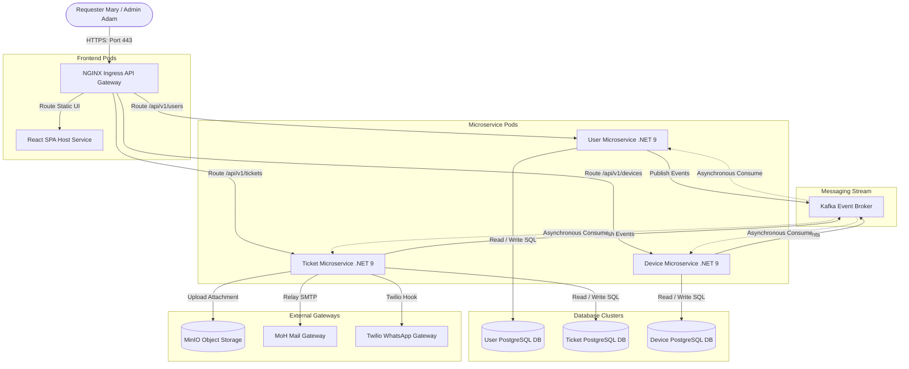

import ZoomableImage from '@site/src/components/ZoomableImage';
import deploymentTopology from './images/deployment_topology.png';

# 12.2 Deployment & Testing

This section defines the infrastructure deployment topology, testing plan, and QA verification matrices.

---

## 12.2.1 Deployment Topology

The MoH Helpdesk is hosted as a microservice framework within a Kubernetes (K8s) cluster.

<ZoomableImage src={deploymentTopology} alt="Deployment Topology" />

