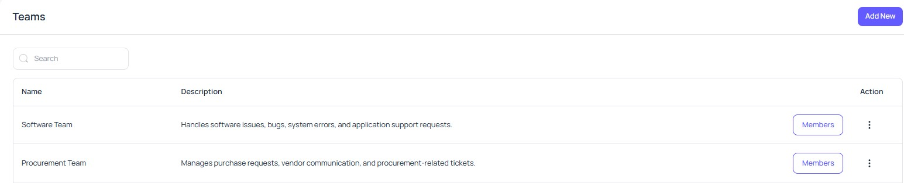
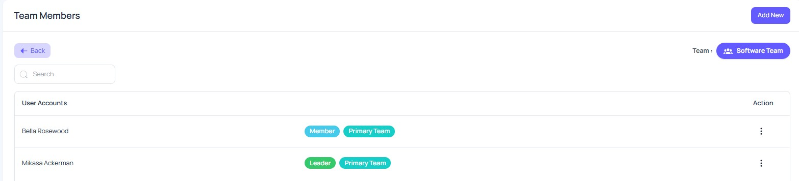
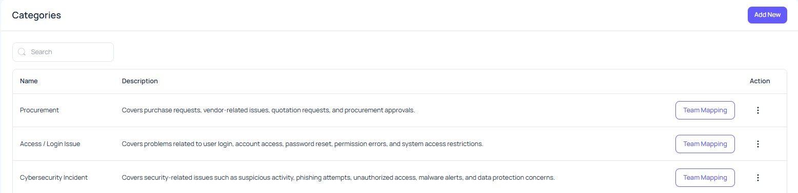
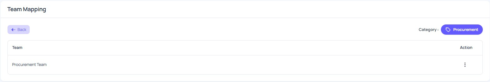
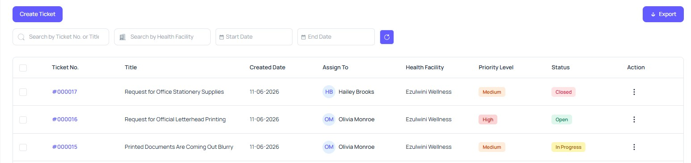
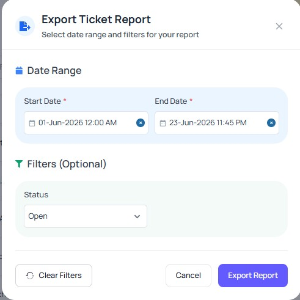
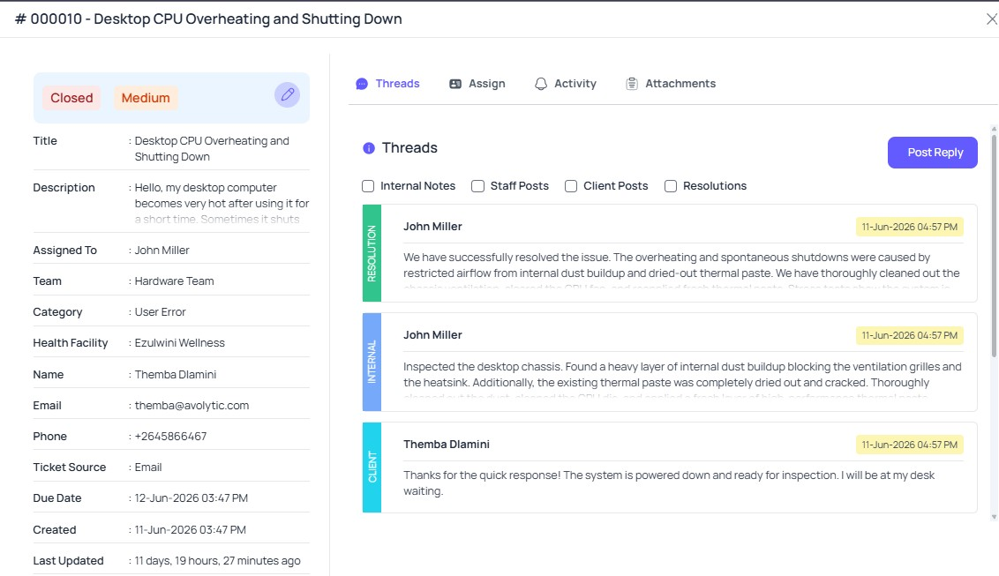
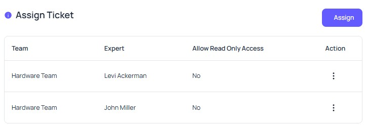

# 2. Service Desk

The Service Desk module provides a centralized workspace for creating, assigning, tracking, communicating, and resolving support tickets. Tickets can be created from the public portal, email, or the internal ticket form.

This module helps Admins, Agents, and Experts manage support requests efficiently through role-based access, team assignment, category mapping, threaded communication, file attachments, email notifications, and activity tracking.

Before users start managing tickets, it is recommended to set up **Teams** and **Categories** first. Teams define who will handle tickets, while categories help route tickets to the correct support team.

---

## 2.1 Teams

The Teams page is used to create and manage Service Desk support teams. Teams help organize users so tickets can be assigned and handled efficiently.

A well-organized team structure improves ticket routing, responsibility tracking, and resolution speed.

---

### 2.1.1 Team List

The team list displays all available Service Desk teams.

Users can view team names, short descriptions, and available options from this page. The search box can be used to quickly find a specific team when many teams are available.

The available action options may allow users to edit or delete a team. These actions should be handled carefully because team changes may affect ticket assignment, routing, and user access.

  

---

### 2.1.2 Add New Team

Users with permission can create a new Service Desk team.

A team usually includes a team name and a short description. The team name should clearly describe the team’s responsibility so that tickets can be routed correctly.

Creating proper teams helps organize support work and improves ticket management.

---

### 2.1.3 Team Members

Each team has a members section where users can manage assigned team members.

A team may include leaders and members. A user may also belong to multiple teams, but one team can be marked as the primary team.

From this section, users may also edit a team member’s role or remove a member from the team, depending on permission.

Team membership helps define who can work on tickets assigned to a specific team.

  

---

### 2.1.4 Add Team Member

Users with permission can add members to a selected team.

When adding a member, the user may define whether the person is a team leader or a regular member. Leaders usually supervise the team, while members work on assigned tickets.

Adding the correct users to the correct teams helps improve accountability and ticket handling.

---

## 2.2 Categories

The Categories page is used to create ticket categories and map them to support teams. Categories help route tickets to the correct team based on the type of issue reported.

A clear category structure helps users select the correct issue type and helps Admins ensure that tickets reach the right team.

---

### 2.2.1 Category List

The category list displays all available ticket categories.

Users can view category names, descriptions, team mapping options, and available actions from this page. The search bar can be used to quickly find a specific category when many categories are available.

Example categories may include Software Issue, Network Issue, Hardware Issue, Procurement Issue, and Printing Issue.

The available action options may allow users to edit category details or manage mapped teams. Categories should be maintained carefully because incorrect category setup may affect ticket routing.

  

---

### 2.2.2 Add New Category

Users with permission can create a new ticket category.

A category usually includes a category name and a short description. Category names should be simple and clear so users can select the correct category while creating tickets.

Clear categories help reduce confusion and improve ticket routing.

---

### 2.2.3 Team Mapping

The Team Mapping option allows users to map a category to one or more support teams.

This ensures that tickets are routed to the correct team based on the selected category.

For example, Software Issue can be mapped to the Software Support Team, Network Issue can be mapped to the Network Support Team, and Printing Issue can be mapped to the Printing Support Team.

Users may also update or remove mapped teams when required. Category-team mapping should be configured carefully because incorrect mapping may route tickets to the wrong team and delay resolution.

  

---

## 2.3 Roles and Access

Service Desk access is controlled by user roles and admin-defined permissions.

Each role has a different level of ticket visibility and available actions.

| Role                    | Access Level                                                                                     |
| ----------------------- | ------------------------------------------------------------------------------------------------ |
| **Service Desk Admin**  | Can access all Service Desk tickets and manage settings such as teams, categories, and mappings. |
| **Service Desk Agent**  | Can access Service Desk tickets within their assigned organization.                              |
| **Service Desk Expert** | Can access only the tickets assigned to them.                                                    |

All three roles can create tickets. The main difference between these roles is ticket visibility and available actions based on permissions.

---

## 2.4 Email Notifications

The Service Desk module sends email notifications when important ticket actions occur. These alerts help responsible users stay updated without needing to check the system manually every time.

Notifications may be sent to Service Desk Admins, Team Leads, assigned persons, or assigned experts depending on the ticket source, assigned team, assigned expert, and configured permissions.

Common email notifications include:

| Alert Type                  | Description                                                                                                         |
| --------------------------- | ------------------------------------------------------------------------------------------------------------------- |
| **New Ticket Alert**        | Sent when a new ticket is created.                                                                                  |
| **Ticket Assignment Alert** | Sent when a ticket is assigned to an expert or responsible person.                                                  |
| **New Message Alert**       | Sent when a new message is added to a ticket thread.                                                                |
| **New Internal Note Alert** | Sent when an internal note is added to a ticket.                                                                    |
| **Overdue Ticket Alert**    | Sent when a ticket is marked as Overdue after exceeding the configured time threshold without progress or activity. |
| **Ticket Close Alert**      | Sent when a ticket is closed.                                                                                       |

Email notifications help users respond quickly and reduce the chance of missing important ticket updates.

---

## 2.5 Tickets

The Tickets page is the main workspace for managing Service Desk requests. It allows users to view, create, search, filter, assign, communicate, and track tickets from one place.

This is where Admins, Agents, and Experts spend most of their time working on support requests.

---

### 2.5.1 Ticket Dashboard

The ticket dashboard displays summary cards for quick monitoring.

  

Common summary cards include:

| Summary Card            | Description                                                                                  |
| ----------------------- | -------------------------------------------------------------------------------------------- |
| **Total Tickets**       | Shows the total number of tickets available to the user.                                     |
| **Open Tickets**        | Shows tickets that have been created but not yet completed.                                  |
| **In-Progress Tickets** | Shows tickets currently being worked on.                                                     |
| **Overdue Tickets**     | Shows tickets that have exceeded the configured time threshold without progress or activity. |
| **Closed Tickets**      | Shows tickets that have been resolved and closed.                                            |

These cards help users quickly understand ticket volume, current workload, and overall progress.

---

### 2.5.2 Ticket Creation Channels

Tickets can be created from multiple sources.

Available ticket creation channels include:

| Channel                         | Description                                                                    |
| ------------------------------- | ------------------------------------------------------------------------------ |
| **Public Portal**               | Allows facility users to create and track their own support requests.          |
| **Email**                       | Allows users to submit tickets by sending an email.                            |
| **Internal Create Ticket Form** | Allows internal Service Desk users to create tickets directly from the system. |

Multiple ticket creation channels make the support process more flexible and accessible.

---

### 2.5.3 Ticket List

The ticket list displays accessible tickets in a table format. The tickets shown depend on the user’s role and permission.

  

From the ticket list, users can quickly review important ticket information such as ticket number, title, created date, assignee, source, priority, status, and available actions.

The ticket list helps users monitor requests and take action without opening each ticket individually.

---

### 2.5.4 Search, Filter, and Export

The Tickets page includes search, filter, and export options to help users manage ticket records efficiently.

Users can search tickets by ticket number, ticket title, or health facility. They can also filter tickets by assignment status, start date, and end date.

The export option can be used for reporting, review, or record-keeping purposes.

  

---

### 2.5.5 Create Ticket

The Create Ticket form is used to submit a new Service Desk ticket.

Users should provide a clear title, detailed summary, ticket source, priority, team, expert if required, facility user information, and any relevant attachments.

A clear and complete ticket helps the support team understand the issue quickly and assign it to the correct person or team.

---

### 2.5.6 Priority and Status

Tickets use priority and status labels to show urgency and progress.

Priority helps users understand how urgent a ticket is. Common priority levels may include Low, Medium, High, and Critical.

Status helps users understand the current stage of the ticket. Common status labels may include Open, In Progress, and Closed.

Using priority and status properly helps the support team manage workload and track resolution progress.

---

### 2.5.7 Ticket Details

The Ticket Details page shows complete information about a selected ticket.

  

This page usually includes the ticket title, ticket number, summary, source, priority, status, assigned team, assigned expert, facility user information, attachments, communication threads, and activity timeline.

The Ticket Details page helps users understand the full context of a request before replying, updating, reassigning, or closing the ticket.

---

### 2.5.8 Communication Threads

Ticket communication is organized into threads so that users can follow conversations clearly.

Thread types may include:

| Thread Type            | Description                                               |
| ---------------------- | --------------------------------------------------------- |
| **Staff Posts**        | Messages added by internal Service Desk users.            |
| **Client Posts**       | Messages added by request users or facility users.        |
| **Internal Notes**     | Notes added for internal team communication.              |
| **Resolution Updates** | Updates related to the solution or closure of the ticket. |

Communication threads keep all ticket-related discussions in one place and make it easier to review the full conversation history.

---

### 2.5.9 Attachments

Users can upload, preview, and delete attachments related to tickets or replies.

Attachments help the support team understand and verify issues more clearly. These may include screenshots, reports, documents, images, or other supporting files.

The system accepts common file formats such as PDF, DOC, DOCX, TXT, JPG, and PNG. Each uploaded file must not exceed **5MB**.

---

### 2.5.10 Reassign Ticket

Tickets can be reassigned to another expert or responsible person when required.

  

Reassignment helps ensure that the correct person handles the issue. The full ticket history remains available after reassignment, so previous actions and communication can still be reviewed.

This is useful when a ticket needs a different expert or when workload needs to be adjusted.

---

### 2.5.11 Activity Timeline

The activity timeline shows a complete record of ticket actions.

It may include ticket creation, ticket updates, status changes, and reassignments.

The activity timeline helps maintain transparency and accountability throughout the ticket lifecycle. It also helps Admins and Agents understand what has already happened before taking the next action.

---

### 2.5.12 Edit Ticket

Users with permission can update ticket information when needed.

Editable information may include the summary, contact information, assigned team, priority, or other permitted ticket details.

Ticket editing should be done carefully so that important information remains accurate and useful for future tracking.
