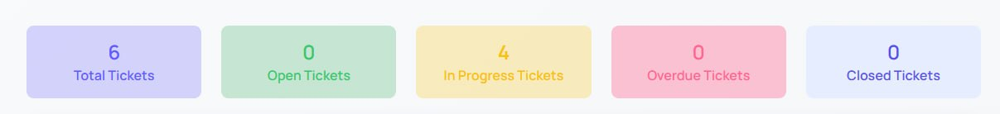
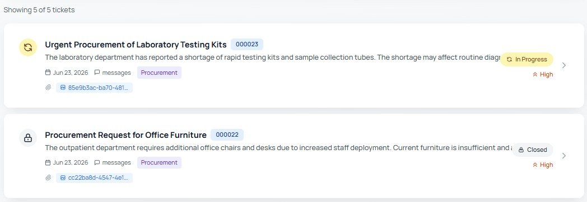
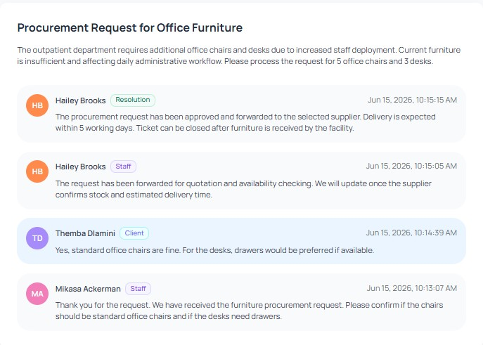
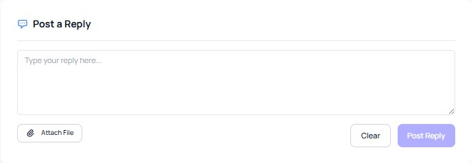
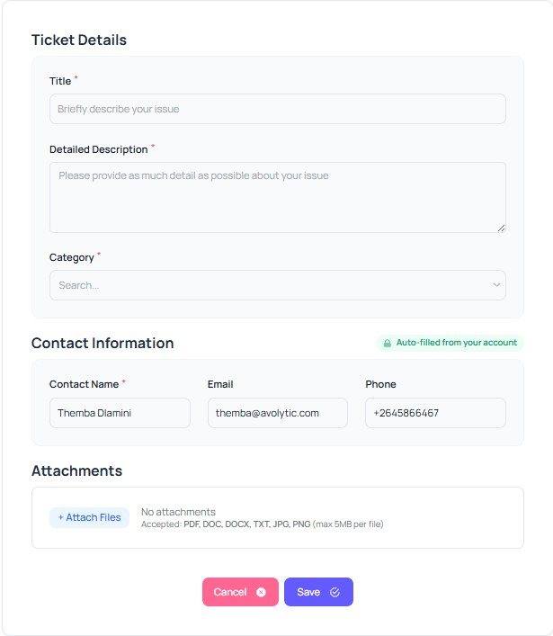

# 3. Facility User
Facility users can log in to the public portal, configured by the admin, using their existing account and manage their own support tickets from the portal.

If a facility user does not have account access yet, they will need to set their password first and then log in to the portal.

Through the public portal, facility users can open new tickets, view submitted tickets, search and filter tickets, track ticket status and priority, view ticket details, communicate with the support team, upload attachments, and review ticket conversation history.

---

## 3.1 Accessing the Public Portal

Facility users can access the Service Desk from the public helpdesk portal.

After logging in with an existing facility user account, users can access the main portal options from the top navigation. These options usually include **Open a New Ticket** and  **My Tickets**.

If a facility user does not have account access yet, they must set their password first before logging in.

---

## 3.2 My Tickets

The **My Tickets** page allows facility users to monitor and manage all support tickets submitted from their account.

This page provides a simple overview of ticket activity, search and filter options, and a list of submitted tickets. It helps facility users quickly understand the current progress of their requests.

---

### 3.2.1 Ticket Summary Cards

At the top of the **My Tickets** page, users can see ticket summary cards.

  

These cards usually show the total number of tickets, open tickets, in-progress tickets, overdue and closed tickets. This helps facility users quickly understand how many tickets they have submitted and what stage those tickets are currently in.

The summary cards are useful for checking ticket progress at a glance before opening individual ticket details.

---

### 3.2.2 Ticket Search and Filters

Facility users can search and filter their tickets to find specific requests quickly.

Users can search by ticket title or ticket ID. They can also filter tickets by status and priority. A **Clear Filters** option is available to reset selected filters and return to the full ticket list.

This makes it easier for users to find older tickets, urgent tickets, or tickets with a specific status.

---

### 3.2.3 Ticket List

The ticket list displays submitted tickets in a clean card-based layout.

  

Each ticket card usually shows the main ticket information, such as the ticket title, ticket ID, short description, created date, message count, category, status, priority, and attachment indicator if available.

Users can click a ticket card to open the detailed ticket view and review the full ticket information.

---

### 3.2.4 Ticket Status and Priority

Ticket status shows the current progress of a support request. Common statuses may include **Open**, **In Progress**, and **Closed**.

If a ticket is marked as **In Progress**, it means the support team is already working on the issue. If a ticket is marked as **Closed**, it means the issue has been resolved or completed.

Ticket priority shows the urgency level of the request. Common priority levels may include **Low**, **High**, and **Critical**.

For example, a password issue or urgent procurement request may be marked as **High** if it affects daily operations.

---

## 3.3 Ticket Details

The **Ticket Details** page shows complete information about a selected ticket.

This page helps facility users review ticket information, current progress, contact details, communication history, and support team responses from one place.

---

### 3.3.1 Ticket Information

The ticket information area shows the basic details of the selected ticket.

It may include the created date, due date, priority, and current ticket status. This helps facility users quickly understand the timeline, urgency, and progress of the ticket.

---

### 3.3.2 Contact Information

The contact information area displays the facility user details linked to the ticket.

This may include the contact name, email address, phone number, and facility or organization name. The support team uses this information to communicate with the correct facility user.

Facility users should make sure their contact information is accurate so the support team can reach them when needed.

---

### 3.3.3 Ticket Conversation

The main ticket detail area displays the full conversation history.

  

The conversation may include client messages, staff replies, and resolution updates. Each message usually includes the sender name, message type, and timestamp.

This helps facility users follow the full discussion and understand what actions have already been taken by the support team.

---

### 3.3.4 Post a Reply

Facility users can post replies from the ticket detail page.

To continue a conversation, users can open a ticket from the **My Tickets** page, go to the reply section, write their message, attach a file if needed, and submit the reply.

  

Replies help facility users communicate directly with the support team without creating a new ticket for the same issue.

---

### 3.3.5 Attach Files in Reply

Facility users can attach files when posting a reply.

Attachments may be useful for screenshots, error messages, supporting documents, procurement files, or any evidence related to the issue.

Adding relevant attachments helps the support team understand the problem more clearly and respond more effectively.

---

## 3.4 Open a New Ticket

The **Open a New Ticket** page allows facility users to submit a new support request from the public portal.

Users should provide clear and complete information so the support team can understand, categorize, and handle the issue properly.

---

### 3.4.1 Ticket Details Form

The ticket details form collects the main issue information.

  

Users should provide a short and clear title, a detailed description, and the correct category. The title should briefly describe the issue, while the description should explain what happened, when it happened, which page or service was affected, any error message, and what help is needed.

For example, a good ticket title could be **Password reset link expired**.

A clear description could explain that the password reset link sent by email expired before the user could use it, and that a new reset link is needed.

---

### 3.4.2 Category Selection

The category helps route the ticket to the correct support team.

Users should choose the category that best matches their issue. Example categories may include **Software**, **Procurement**, **Hardware**, **Network**, and **Printing**.

Selecting the correct category helps reduce delays and ensures that the ticket reaches the right support team.

---

### 3.4.3 Contact Information

The contact information section is usually auto-filled from the facility user account.

It may include the contact name, email address, phone number, and facility or organization information. Facility users should review this information before submitting the ticket.

Correct contact information helps the support team communicate with the user if more details are needed.

---

### 3.4.4 Attachments

Facility users can upload supporting files while creating a ticket.

Attachments help the support team understand and verify the issue more clearly. Users may upload screenshots, error messages, supporting documents, procurement documents, or other issue-related files.

The system accepts common file formats such as **PDF**, **DOC**, **DOCX**, **TXT**, **JPG**, and **PNG**. Each uploaded file must not exceed **5MB**.

For example, if a user is reporting a system error, they can upload a screenshot in JPG or PNG format. If the issue is related to procurement, they can attach a PDF, DOC, or DOCX file as supporting evidence.

---

### 3.4.5 Submit a Ticket

After completing the form, users can submit the ticket by clicking **Save**.

Users may also click **Cancel** if they do not want to submit the ticket.

After submission, the ticket will be available on the **My Tickets** page, where users can track its progress and communicate with the support team.

---

## 3.5 Email Notifications

Facility users may receive email notifications when important ticket actions occur.

These notifications help users stay updated about ticket progress and support team responses without needing to check the portal manually every time.

Common email notifications for facility users include:

* New ticket alert
* New message alert
* Ticket close alert

---

### 3.5.1 New Ticket Alert

A **New Ticket Alert** may be sent after a facility user successfully creates a ticket.

This confirms that the ticket has been submitted to the Service Desk.

---

### 3.5.2 New Message Alert

A **New Message Alert** may be sent when the support team posts a new reply or update on the ticket.

This helps facility users respond quickly if additional information is required.

---

### 3.5.3 Ticket Close Alert

A **Ticket Close Alert** may be sent when the ticket is closed by the support team.

This confirms that the issue has been resolved or completed.
