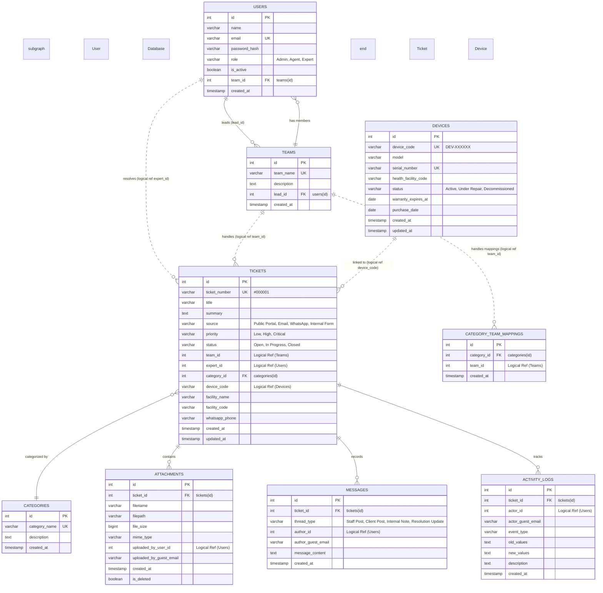

# 6. Data Architecture

This section details the **Data Model** and **Database Design** of the MoH Helpdesk Management System. The databases are partitioned into three PostgreSQL databases: **User DB**, **Ticket DB**, and **Device DB**.

---

## 6.1 Entity Definitions

1. **Users**: System operators (Admins, Agents, Experts) with role classifications.
2. **Teams**: Operational support groups (e.g. Network Support Team).
3. **Categories**: Issue classifications (e.g. Software, Hardware, Printing).
4. **Team Mappings**: Linking categories to teams.
5. **Tickets**: Support cases with sequential identifiers (e.g. `#000001`), descriptions, and status values.
6. **Messages**: Public conversation logs between clients and agents.
7. **Notes**: Private collaboration logs visible only to staff.
8. **Attachments**: Metadata of uploaded screenshots or logs (maximum 5 MB).
9. **Notifications**: Log of email and WhatsApp alerts sent by the worker.
10. **Activity Logs**: Immutable audit trails.

---

## 6.2 Entity Relationship Diagram (ERD)



---

## 6.3 PostgreSQL DDL Schemas

### 6.3.1 User Database Schema
```sql
CREATE TABLE teams (
    id SERIAL PRIMARY KEY,
    team_name VARCHAR(50) NOT NULL UNIQUE,
    description TEXT,
    lead_id INTEGER,
    created_at TIMESTAMP WITH TIME ZONE DEFAULT CURRENT_TIMESTAMP NOT NULL
);

CREATE TABLE users (
    id SERIAL PRIMARY KEY,
    name VARCHAR(100) NOT NULL,
    email VARCHAR(100) NOT NULL UNIQUE,
    password_hash VARCHAR(255) NOT NULL,
    role VARCHAR(20) NOT NULL CHECK (role IN ('Admin', 'Agent', 'Expert')),
    is_active BOOLEAN DEFAULT TRUE NOT NULL,
    team_id INTEGER REFERENCES teams(id) ON DELETE SET NULL,
    created_at TIMESTAMP WITH TIME ZONE DEFAULT CURRENT_TIMESTAMP NOT NULL,
    updated_at TIMESTAMP WITH TIME ZONE DEFAULT CURRENT_TIMESTAMP NOT NULL
);

ALTER TABLE teams ADD CONSTRAINT fk_teams_lead FOREIGN KEY (lead_id) REFERENCES users(id) ON DELETE SET NULL;
```

---

### 6.3.2 Ticket Database Schema
```sql
CREATE TABLE categories (
    id SERIAL PRIMARY KEY,
    category_name VARCHAR(50) NOT NULL UNIQUE,
    description TEXT,
    created_at TIMESTAMP WITH TIME ZONE DEFAULT CURRENT_TIMESTAMP NOT NULL
);

CREATE TABLE category_team_mappings (
    id SERIAL PRIMARY KEY,
    category_id INTEGER NOT NULL REFERENCES categories(id) ON DELETE CASCADE,
    team_id INTEGER NOT NULL, -- Logical reference to User DB (teams)
    created_at TIMESTAMP WITH TIME ZONE DEFAULT CURRENT_TIMESTAMP NOT NULL,
    UNIQUE (category_id, team_id)
);

CREATE SEQUENCE ticket_number_seq;

CREATE TABLE tickets (
    id SERIAL PRIMARY KEY,
    ticket_number VARCHAR(30) DEFAULT concat('#', lpad(nextval('ticket_number_seq')::text, 6, '0')) NOT NULL UNIQUE,
    title VARCHAR(150) NOT NULL,
    summary TEXT NOT NULL,
    source VARCHAR(30) NOT NULL CHECK (source IN ('Public Portal', 'Email', 'WhatsApp', 'Internal Form')),
    priority VARCHAR(20) NOT NULL CHECK (priority IN ('Low', 'High', 'Critical')),
    status VARCHAR(20) DEFAULT 'Open' NOT NULL CHECK (status IN ('Open', 'In Progress', 'Closed')),
    team_id INTEGER, -- Logical reference to User DB
    expert_id INTEGER, -- Logical reference to User DB
    category_id INTEGER REFERENCES categories(id) ON DELETE SET NULL,
    device_code VARCHAR(30), -- Logical reference to Device DB
    facility_name VARCHAR(150) NOT NULL,
    facility_code VARCHAR(30) NOT NULL,
    whatsapp_phone VARCHAR(30),
    created_at TIMESTAMP WITH TIME ZONE DEFAULT CURRENT_TIMESTAMP NOT NULL,
    updated_at TIMESTAMP WITH TIME ZONE DEFAULT CURRENT_TIMESTAMP NOT NULL
);

CREATE INDEX idx_tickets_number ON tickets(ticket_number);
CREATE INDEX idx_tickets_status ON tickets(status);
CREATE INDEX idx_tickets_facility_code ON tickets(facility_code);

CREATE TABLE attachments (
    id SERIAL PRIMARY KEY,
    ticket_id INTEGER NOT NULL REFERENCES tickets(id) ON DELETE CASCADE,
    filename VARCHAR(255) NOT NULL,
    filepath VARCHAR(512) NOT NULL,
    file_size BIGINT NOT NULL CHECK (file_size <= 5242880),
    mime_type VARCHAR(100) NOT NULL,
    uploaded_by_user_id INTEGER, -- Logical reference to User DB
    uploaded_by_guest_email VARCHAR(100),
    created_at TIMESTAMP WITH TIME ZONE DEFAULT CURRENT_TIMESTAMP NOT NULL,
    is_deleted BOOLEAN DEFAULT FALSE NOT NULL
);

CREATE TABLE messages (
    id SERIAL PRIMARY KEY,
    ticket_id INTEGER NOT NULL REFERENCES tickets(id) ON DELETE CASCADE,
    thread_type VARCHAR(30) NOT NULL CHECK (thread_type IN ('Staff Post', 'Client Post', 'Internal Note', 'Resolution Update')),
    author_id INTEGER, -- Logical reference to User DB
    author_guest_email VARCHAR(100),
    message_content TEXT NOT NULL,
    created_at TIMESTAMP WITH TIME ZONE DEFAULT CURRENT_TIMESTAMP NOT NULL
);

CREATE TABLE activity_logs (
    id SERIAL PRIMARY KEY,
    ticket_id INTEGER NOT NULL REFERENCES tickets(id) ON DELETE CASCADE,
    actor_id INTEGER, -- Logical reference to User DB
    actor_guest_email VARCHAR(100),
    event_type VARCHAR(50) NOT NULL,
    old_values TEXT,
    new_values TEXT,
    description TEXT NOT NULL,
    created_at TIMESTAMP WITH TIME ZONE DEFAULT CURRENT_TIMESTAMP NOT NULL
);

CREATE OR REPLACE FUNCTION block_modify_audit_log()
RETURNS TRIGGER AS $$
BEGIN
    RAISE EXCEPTION 'Updates and deletions are strictly prohibited on the activity_logs table.';
END;
$$ LANGUAGE plpgsql;

CREATE TRIGGER trg_activity_logs_immutable
BEFORE UPDATE OR DELETE ON activity_logs
FOR EACH ROW EXECUTE FUNCTION block_modify_audit_log();
```

---

### 6.3.3 Device Database Schema
```sql
CREATE TABLE devices (
    id SERIAL PRIMARY KEY,
    device_code VARCHAR(30) NOT NULL UNIQUE,
    model VARCHAR(100) NOT NULL,
    serial_number VARCHAR(100) NOT NULL UNIQUE,
    health_facility_code VARCHAR(30) NOT NULL,
    status VARCHAR(30) DEFAULT 'Active' NOT NULL CHECK (status IN ('Active', 'Under Repair', 'Decommissioned')),
    warranty_expires_at DATE,
    purchase_date DATE,
    created_at TIMESTAMP WITH TIME ZONE DEFAULT CURRENT_TIMESTAMP NOT NULL,
    updated_at TIMESTAMP WITH TIME ZONE DEFAULT CURRENT_TIMESTAMP NOT NULL
);

CREATE INDEX idx_devices_code ON devices(device_code);
```
