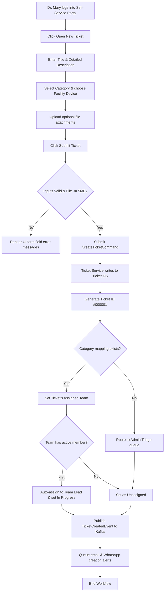
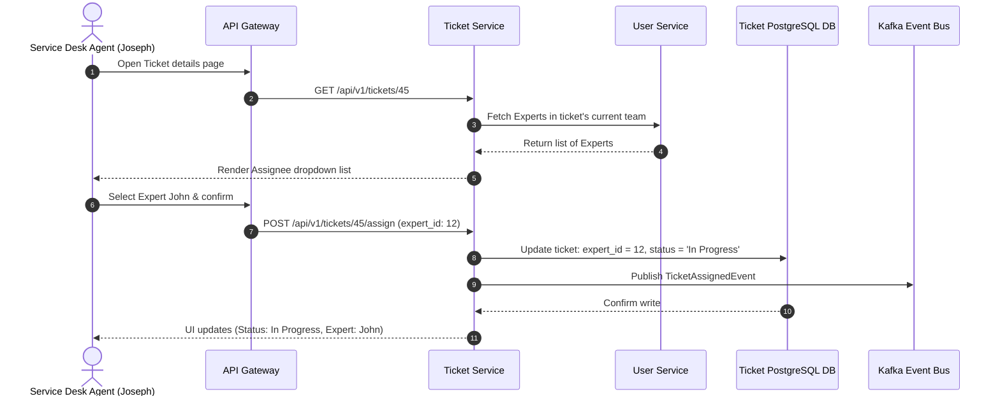
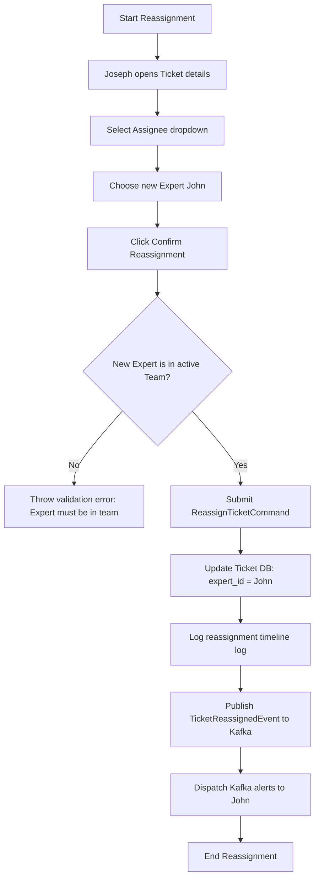
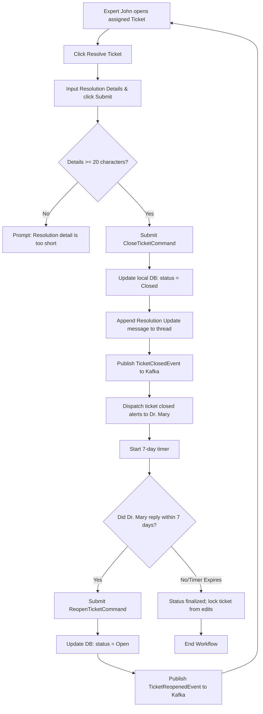

# 6. Process Workflows

This section visualizes the key operational workflows of the MoH Helpdesk Management System using **Mermaid diagrams**.

---

## 6.1 Facility User Ticket Creation Flow

Visualizes how Dr. Mary submits a ticket, associates a device, and triggers team mapping.



---

## 6.2 Ticket Assignment Flow

Shows Joseph assigning a ticket to John.



---

## 6.3 Ticket Reassignment Flow

Shows reassigning a ticket to a different expert.



---


## 6.4 Ticket Resolution Flow

Tracks ticket resolution, closure, and the 7-day reopen window.



---

## 6.5 Notification Engine Flow

Visualizes the event-driven notifications loop.

```mermaid
sequenceDiagram
    autonumber
    participant App as Ticket Service Command
    participant Kafka as Kafka Event Bus
    participant Worker as Background Alert Consumer
    participant Templates as Template Engine
    participant Gateways as SMTP / WhatsApp Gateways
    actor Mary as Recipient (Dr. Mary)
    
    App->>App: Process Command (e.g. Ticket Closed)
    App->>Kafka: Publish Event (Event ID, Submitter Details)
    App-->>App: Return success to UI immediately
    
    Note over Worker: Listens to Kafka topic 'ticket-notifications'
    Kafka-.>>Worker: Deliver TicketClosedEvent message
    Worker->>Templates: Fetch template matching event
    Templates-->>Worker: Return compiled body
    Worker->>Gateways: Dispatch payloads (SMTP/Twilio API)
    Gateways->>Mary: Deliver Email / WhatsApp message
```
