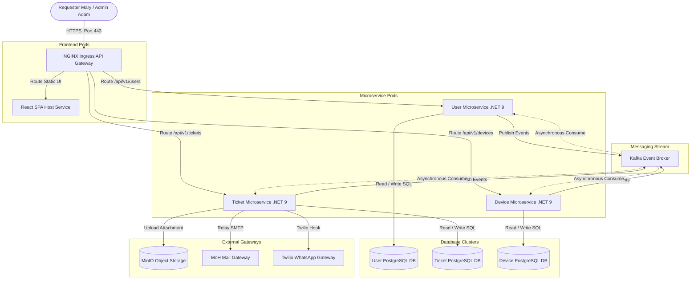

# 9. Deployment & Testing

This section defines the infrastructure deployment topology, testing plan, and QA verification matrices.

---

## 9.1 Deployment Topology

The MoH Helpdesk is hosted as a microservice framework within a Kubernetes (K8s) cluster.

---

## 9.2 Testing Strategy

The QA strategy is composed of five specialized verification layers:

1. **Unit Testing**: Focuses on validation logic and calculated model responses. Written using xUnit in .NET 9. Target coverage: **>85%**.
2. **Integration Testing**: Verifies DB trigger restrictions and MediatR handler pipeline registrations.
3. **Kafka Event Testing**: Validates event payloads and consumer updates.
4. **Performance Testing**: JMeter workloads simulate 1,000 active concurrent connections to monitor REST latency.
5. **Security Testing**: Verifies OAuth2/JWT Bearer validations, cross-site scripting (XSS), and CORS rules.

---

## 9.3 QA Test Cases Matrix

| Test ID | Module | Test Objective | Input / Action | Expected Result | Pass/Fail |
|:---|:---|:---|:---|:---|:---:|
| **TC-TICK-001** | Ticket Creation | Rejects file sizes over 5MB | Select file `dump.zip` (6.2 MB) in attachment editor. | Submission blocked; UI prints: *"File exceeds maximum size of 5 MB."* | - |
| **TC-TICK-002** | Ticket ID | Verifies `#000001` sequence formatting | Submit a valid ticket via portal. | Database returns unique sequential format `#XXXXXX` matching next serial sequence. | - |
| **TC-AUTH-001** | RBAC | Enforces Expert view restriction | John attempts to call GET `/api/v1/tickets` (all tickets). | Endpoint intercepts request, decodes role token, returns `403 Forbidden`. | - |
| **TC-ROUT-001** | AI Engine | Verifies NLP routing classification | Submit ticket: *"Printers in Jes Clinic offline."* | AI parses text, classifies category as **Printing**, routes to Printing Team Lead. | - |
| **TC-DEVC-001** | Device link | Rejects cross-facility linking | Attempt to link a device from facility RNG-201 to Jessore Clinic ticket `#000045`. | API returns `422 Unprocessable Entity`; throws `ValidationError`. | - |
| **TC-AUDT-001** | Auditing | Rejects audit log data edits | Attempt to run: `DELETE FROM activity_logs;` | Database trigger blocks transaction, aborts execution. | - |
